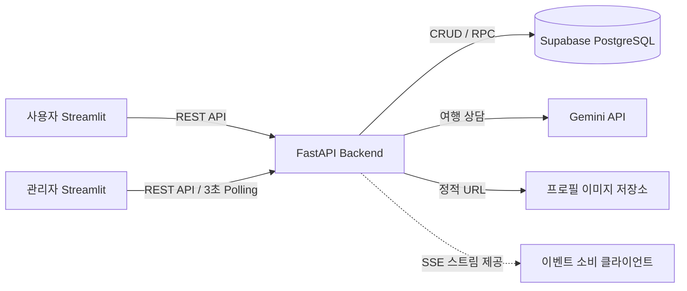

# ✈️ Airport — 항공권 예약 및 운영 관리 서비스

> 항공편 검색부터 좌석 예약, AI 여행 상담, 관리자 운영 모니터링까지 하나의 흐름으로 구현한 팀 프로젝트입니다.

FastAPI에서 REST API와 인증·검증·예외 처리를 담당하고, Streamlit 사용자/관리자 화면이 이를 호출합니다.  
데이터는 Supabase PostgreSQL에 저장하며 Gemini를 활용한 AI 여행 도우미도 제공합니다.

## 바로 체험하기

| 서비스 | 주요 기능 | 배포 링크 |
|---|---|---|
| 👤 사용자 서비스 | 항공편 검색, 좌석 예약, 내 예약, AI 여행 도우미, 피드백 | **[사용자 앱 실행하기](https://aio-01-p1-team5-5fq798bdzhgpcwugm4vjf4.streamlit.app/)** |
| 🛠️ 관리자 서비스 | 운영 대시보드, 항공편·좌석·예약·사용자 관리, 이벤트·피드백 확인 | **[관리자 앱 실행하기](https://aio-01-p1-team5-8njregq2npmbnzmoetppuj.streamlit.app/)** |

> Streamlit Cloud 무료 인스턴스가 대기 상태이면 첫 화면을 불러오는 데 시간이 걸릴 수 있습니다.

## 프로젝트 한눈에 보기


## 프로젝트 핵심

- **사용자 흐름 완성:** 회원가입·로그인 → 항공편 검색 → 좌석 선택 → 예약 → 조회·취소
- **운영 기능 분리:** USER/ADMIN 권한을 나누고 관리자 전용 CRUD와 대시보드 제공
- **데이터 무결성:** 같은 좌석의 중복 예약을 DB 제약과 원자적 예약 처리로 방지
- **AI 기능 연동:** Gemini 기반 여행 도우미와 답변 평가·관리자 저평가 분석 흐름 구현
- **오류 대응 표준화:** 입력 검증, 인증·권한 오류, 충돌, 외부 API 오류를 일관된 형식으로 처리
- **운영 가시성:** 주요 변경을 이벤트 로그로 남기고 관리자 화면에서 3초 주기로 갱신

## 주요 기능

### 사용자

1. 회원가입, 로그인, 로그아웃
2. 출발지·도착지·날짜·인원·좌석 등급별 항공편 검색
3. 항공편 상세 및 잔여 좌석 확인, 좌석 선택과 예약
4. 내 예약 조회 및 취소 사유를 포함한 예약 취소
5. 이름과 프로필 이미지 조회·수정
6. Gemini AI 여행 도우미 상담
7. 서비스 만족도 및 최근 챗봇 답변 평가

### 관리자

1. 관리자 로그인과 권한 검증
2. 핵심 운영 지표, 최근 이벤트, 챗봇 평가 대시보드
3. 항공편·좌석·예약·사용자 관리
4. 이벤트 유형·기간·대상 ID별 로그 필터링과 상세 조회
5. 일반 피드백과 챗봇 저평가 내역 확인·분류·메모
6. 실시간 모니터의 3초 자동 갱신

## 기술 스택과 수업 내용 적용

| 영역 | 사용 기술 | 프로젝트에서 적용한 내용 |
|---|---|---|
| Frontend | Streamlit, Pandas | 멀티 페이지, Navigation, Session State, 표·지표·차트, 사용자/관리자 앱 분리 |
| Backend | Python, FastAPI, Uvicorn | Router–Schema–Service 계층, REST API, 의존성 기반 인증·권한 검사 |
| Validation | Pydantic | 요청 필드의 타입·필수값·형식 검증과 422 응답 |
| Database | Supabase PostgreSQL | CRUD, PK/FK, CHECK/UNIQUE 제약, 예약 트랜잭션, 이벤트·피드백 저장 |
| AI | Google Gemini API | 멀티턴 여행 상담, 답변 평가와 저평가 원인 분석 |
| Communication | HTTPX, SSE | 프런트엔드 API 호출, 백엔드 이벤트 스트림과 커서 제공 |
| File | Multipart, StaticFiles | 프로필 이미지 형식·크기 검증, 정적 URL 제공 |
| Test | Pytest | 인증, 사용자, 항공편, 예약 등 API 동작 검증 |
| Deploy | Streamlit Community Cloud | 사용자 앱과 관리자 앱을 독립 배포 |

## 서비스 구조



백엔드는 SSE 스트림을 제공하지만, 현재 관리자 실시간 모니터 화면은 Streamlit 특성에 맞춰   
이벤트 로그 API를 **3초마다 조회하는 polling 방식**으로 구현했습니다.

## 구현 과정에서 집중한 부분

### 1. 요청부터 DB까지 역할 분리

```text
Streamlit 화면 → API Client → FastAPI Router → Pydantic Schema
               → Service → Supabase PostgreSQL → 공통 응답
```

- Router는 HTTP 요청과 응답을 담당합니다.
- Schema는 입력값과 응답 데이터의 형태를 검증합니다.
- Service는 예약·취소·권한 확인 같은 비즈니스 규칙을 처리합니다.
- 화면은 공통 API Client를 통해 백엔드 오류를 사용자 메시지로 바꿔 보여 줍니다.

### 2. 중복 예약 방지

같은 좌석에 요청이 동시에 들어와도 하나만 성공하도록 예약 생성 로직을 DB 함수로 묶었습니다.   
행 잠금(`FOR UPDATE`)과 활성 예약 부분 UNIQUE 인덱스를 함께 사용해 애플리케이션 검사만으로는 막기 어려운 동시성 문제를 DB에서도 방어합니다.

### 3. 인증·권한·오류 처리

| 상황 | 처리 방식 | 대표 상태 코드 |
|---|---|---:|
| 필수값 누락·형식 오류 | Pydantic 및 화면 입력 검증 | 400 / 422 |
| 로그인 정보 없음·토큰 오류 | 인증 의존성에서 요청 차단 | 401 |
| 관리자 기능에 일반 사용자 접근 | 역할 기반 권한 검사 | 403 |
| 존재하지 않는 항공편·예약 | 조회 결과 확인 후 공통 오류 응답 | 404 |
| 이미 예약된 좌석·상태 충돌 | DB 제약과 서비스 계층에서 충돌 처리 | 409 |
| Gemini·Supabase 등 외부 연동 실패 | 예외를 공통 API 오류 형태로 변환 | 500 / 502 |

프런트엔드는 필수 입력과 최소 글자 수를 빠르게 안내하고, API는 클라이언트를 신뢰하지 않고 동일한 규칙을 다시 검증합니다. 네트워크·HTTP 오류는 `BackendAPIError`로 통합해 화면별 예외 처리 방식도 맞췄습니다.

### 4. 로그와 피드백으로 개선 가능한 구조

- 항공편·좌석·예약 상태 변경을 `event_logs`에 기록합니다.
- 관리자 모니터에서 이벤트 유형, 기간, 항공편/예약 ID로 필터링합니다.
- 일반 서비스 피드백과 챗봇 평가를 구분해 저장합니다.
- 챗봇 평가에는 대화와 AI 답변을 연결해 저평가 질문·답변·의견을 함께 검토할 수 있습니다.


> 이메일, 이름, 토큰 등 개인정보는 테스트 계정으로 촬영하고 화면에 비밀 키가 노출되지 않도록 확인합니다.

## 🎬 주요 기능 및 예외 처리 시연

### 1. 사용자 항공권 검색 및 예약


### 2. 관리자 운영 및 이벤트 모니터링


### 3. AI 상담과 답변 품질 관리


## 로컬 실행

```powershell
# 1. 공통 가상환경 활성화 후 패키지 설치
pip install -r requirements.txt
pip install -r frontend_user/requirements.txt
pip install -r frontend_admin/requirements.txt

# 2. FastAPI 백엔드 (기본 포트 8000)
uvicorn app.main:app --app-dir backend --reload

# 3. 사용자 화면 (기본 포트 8501)
streamlit run frontend_user/app.py --server.port 8501

# 4. 관리자 화면 (기본 포트 8502)
streamlit run frontend_admin/app.py --server.port 8502
```

Supabase 및 Gemini 키, 백엔드 URL 등 실행 환경에 맞는 환경 변수 설정이 필요합니다. 비밀 키는 저장소에 커밋하지 않습니다.

## 디렉터리 구조

```text
aio-01-p1-team5/
├─ backend/                 # FastAPI API, 서비스, 스키마, DB SQL, 테스트
├─ frontend_user/           # 사용자 Streamlit 앱과 API Client
├─ frontend_admin/          # 관리자 Streamlit 앱과 API Client
├─ docs/dy/                 # API·화면·DB 설계서와 대시보드 결과 문서
├─ wireframes/              # 초기 화면 설계 자료
├─ plan.md                  # 프로젝트 계획 및 최종 구현 범위
├─ requirements.txt         # 백엔드 공통 패키지
└─ README.md                # 프로젝트 소개 및 발표 자료
```

## 설계 문서

- [API 설계서](docs/dy/api-spec.md)
- [화면 설계서](docs/dy/screen-design.md)
- [데이터베이스 설계서](docs/dy/database-design.md)
- [관리자 대시보드 구현 결과](docs/dy/dashboard-result.md)
- [백엔드 통합 가이드](docs/dy/integration-guide.md)
- [프로젝트 계획서](plan.md)

## 현재 한계와 개선 방향

- 관리자 화면은 SSE 직접 구독이 아닌 3초 polling 방식이므로 향후 전용 웹 프런트엔드에서 SSE 연결을 적용할 수 있습니다.
- 업로드 이미지는 현재 백엔드 로컬 파일 시스템에 저장되므로 재배포에도 유지되는 외부 Object Storage로 이전할 수 있습니다.
- Streamlit Cloud와 외부 백엔드의 대기 해제 시간이 시연에 영향을 줄 수 있어 발표 전에 두 앱을 미리 실행하고 백업 영상을 준비하는 것이 좋습니다.
- 테스트 범위를 동시 예약·권한·외부 API 장애 시나리오까지 넓히고 CI로 자동화할 수 있습니다.
