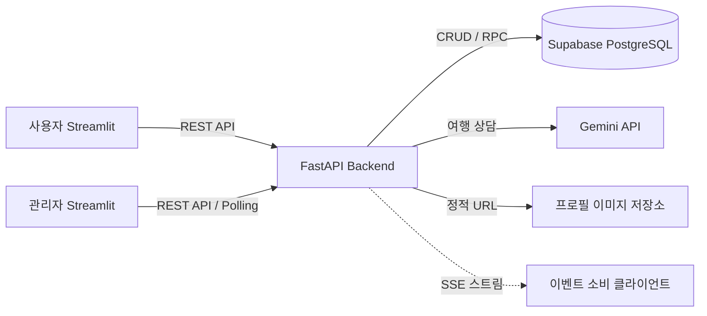

# ✈️ Airport — 항공권 예약 및 운영 관리 서비스

> 항공편 검색부터 좌석 예약, AI 여행 상담, 관리자 운영 모니터링까지 하나의 흐름으로 구현한 팀 프로젝트입니다.

FastAPI와 Streamlit을 기반으로 사용자용 항공권 예약 서비스와 관리자용 운영 관리 서비스를 구현했습니다.  
Supabase PostgreSQL에 데이터를 저장하고, Gemini API를 활용한 AI 여행 도우미 기능을 연동했습니다.

## 🚀 Live Demo

> 프로젝트 종료 후 포트폴리오 및 기능 시연을 위해 개인 계정으로 별도 배포했습니다.

| 서비스 | 주요 기능 | 링크 |
|---|---|---|
| 👤 사용자 서비스 | 항공편 검색·예약, 내 예약, AI 여행 도우미 | [사용자 앱 실행하기](배포_URL) |
| 🛠️ 관리자 서비스 | 운영 대시보드, 항공편·예약·이벤트 관리 | [관리자 앱 실행하기](배포_URL) |

※ 팀 프로젝트 당시 배포 담당 역할에는 참여하지 않았으며,
포트폴리오 정리 과정에서 개인적으로 배포 환경을 구성했습니다.

---

## 📌 프로젝트 소개

항공권을 검색하고 예약하는 사용자 기능과 항공편·예약·이벤트를 관리하는 관리자 기능을 하나의 서비스 흐름으로 구현한 팀 프로젝트입니다.

단순 CRUD 구현을 넘어 다음과 같은 실제 서비스 흐름을 경험하는 것을 목표로 진행했습니다.

- 사용자 인증 및 권한 관리
- 항공편 검색 및 좌석 예약
- 예약 조회 및 취소
- 관리자 항공편·좌석·예약 관리
- 중복 예약 방지
- 이벤트 로그 및 피드백 관리
- Gemini 기반 AI 여행 상담
- 사용자/관리자 화면과 FastAPI 백엔드 연동

**프로젝트 형태:** 4인 팀 프로젝트  
**주요 기술:** Python, FastAPI, Streamlit, Supabase PostgreSQL, Gemini API

---

## 🎬 프로젝트 한눈에 보기


---

## ✨ 주요 기능

### 👤 사용자

1. 회원가입, 로그인, 로그아웃
2. 출발지·도착지·날짜·인원·좌석 등급별 항공편 검색
3. 항공편 상세 및 잔여 좌석 확인
4. 좌석 선택 및 예약
5. 내 예약 조회 및 예약 취소
6. 이름과 프로필 이미지 조회·수정
7. Gemini AI 여행 도우미 상담
8. 서비스 만족도 및 챗봇 답변 평가

### 🛠️ 관리자

1. 관리자 로그인 및 권한 검증
2. 운영 지표 및 최근 이벤트 확인
3. 항공편·좌석·예약·사용자 관리
4. 이벤트 유형·기간·대상별 로그 조회
5. 서비스 피드백 및 챗봇 저평가 내역 확인
6. 관리자 실시간 모니터 자동 갱신

---

## 🙋 담당 역할

### Backend Development

프로젝트에서 백엔드 기능을 담당했습니다.

- 항공편 검색 API
- 항공편·좌석 CRUD 관련 백엔드 기능
- 예약 생성·조회·취소 기능
- 동일 좌석 중복 예약 방지 로직
- 이벤트 로그 생성 및 조회 기능
- 사용자 피드백 저장 및 조회 기능
- 프로필 이미지 업로드 관련 기능
- SSE 기반 이벤트 스트림 제공

### Project Planning & Collaboration

프로젝트 아이디어 제안부터 구조 설계와 진행 과정 검토에 참여했습니다.

- 항공권 예약 및 AI 여행 도우미 프로젝트 아이디어 제안
- 프로젝트 `plan.md` 작성 및 기능 범위 설계
- 팀원별 구현 범위와 완료 기준 정리
- 프로젝트 진행 중 기능 실행 및 결과 검토
- 구현 결과를 확인하고 필요한 수정사항 정리 및 전달
- 팀원 Git 브랜치 충돌 발생 시 문제 해결 지원
- 최종 발표자료 및 필수 산출물 취합·정리
- 프로젝트 완료 후 README 정리

### Documentation

프로젝트 구현 전후의 설계 및 결과를 문서화했습니다.

- 프로젝트 계획서
- API 설계서
- 화면 설계서
- 데이터베이스 설계서
- 관리자 대시보드 구현 결과 문서
- 프로젝트 README

> 데이터베이스 자체 구현을 담당한 것은 아니며, 프로젝트의 데이터 구조와 구현 결과를 바탕으로 데이터베이스 설계 문서를 정리했습니다.

---

## 🛠 기술 스택

| 영역 | 사용 기술 | 프로젝트 적용 내용 |
|---|---|---|
| Frontend | Streamlit, Pandas | 사용자/관리자 화면, 멀티 페이지, Session State, 표·지표·차트 |
| Backend | Python, FastAPI, Uvicorn | REST API, Router–Schema–Service 구조 |
| Validation | Pydantic | 요청 데이터 타입·필수값·형식 검증 |
| Database | Supabase PostgreSQL | CRUD, 관계형 데이터 저장, 제약 조건 및 예약 데이터 관리 |
| AI | Google Gemini API | AI 여행 상담 및 챗봇 답변 평가 |
| Communication | HTTPX, SSE | 프론트엔드 API 호출 및 이벤트 스트림 |
| File | Multipart, StaticFiles | 프로필 이미지 업로드 및 정적 파일 제공 |
| Test | Pytest | 주요 API 동작 테스트 |
| Deploy | Streamlit Community Cloud | 팀 프로젝트 사용자/관리자 앱 배포 |

> 배포 환경은 팀 프로젝트 결과물에 사용되었으며, 개인 담당 역할에는 포함하지 않았습니다.

---

## 🏗 서비스 구조



기본적인 요청 흐름은 다음과 같습니다.

```text
Streamlit
   ↓
API Client
   ↓
FastAPI Router
   ↓
Pydantic Schema
   ↓
Service
   ↓
Supabase PostgreSQL
```

Router는 HTTP 요청과 응답을 담당하고, Schema는 데이터 형식을 검증하며, Service에서는 예약·취소 등 비즈니스 로직을 처리하도록 역할을 분리했습니다.

---

## 🔍 주요 구현 내용

### 1. 요청부터 DB까지 역할 분리

FastAPI 백엔드를 Router → Schema → Service 구조로 나누어 각 계층의 역할을 구분했습니다.

```text
Request
   ↓
Router
   ↓
Schema
   ↓
Service
   ↓
Database
```

이를 통해 HTTP 처리, 데이터 검증, 비즈니스 로직이 한 파일에 섞이지 않도록 구성했습니다.

### 2. 동일 좌석 중복 예약 방지

같은 좌석에 동시에 예약 요청이 들어오는 상황을 고려하여 애플리케이션의 사전 확인만으로 처리하지 않고 DB 수준에서도 중복 예약을 방어하도록 구성했습니다.

행 잠금(`FOR UPDATE`)과 활성 예약에 대한 UNIQUE 제약을 활용하여 동일 좌석에 대한 중복 예약 문제를 방지했습니다.

### 3. 인증·권한·예외 처리

| 상황 | 처리 | 상태 코드 |
|---|---|---:|
| 입력값 누락·형식 오류 | Pydantic 및 입력 검증 | 400 / 422 |
| 로그인 정보 없음·토큰 오류 | 인증 단계에서 요청 차단 | 401 |
| 일반 사용자의 관리자 기능 접근 | 역할 기반 권한 검사 | 403 |
| 존재하지 않는 데이터 | 조회 결과 확인 후 오류 반환 | 404 |
| 이미 예약된 좌석 등 상태 충돌 | DB/Service에서 충돌 처리 | 409 |
| 외부 API 연동 실패 | 공통 API 오류 형태로 처리 | 500 / 502 |

### 4. 이벤트 로그 및 피드백

항공편·좌석·예약 상태 변경과 같은 주요 이벤트를 기록하고 관리자가 이를 조회할 수 있도록 구현했습니다.

또한 일반 서비스 피드백과 챗봇 답변 평가를 저장하여 사용자의 의견과 AI 답변 품질을 확인할 수 있도록 구성했습니다.

---

## 🎥 주요 기능 및 예외 처리 시연

### 1. 사용자 항공권 검색 및 예약


### 2. 관리자 운영 및 이벤트 모니터링


### 3. AI 상담과 답변 품질 관리


---

## 📂 프로젝트 구조

```text
aio-01-p1-team5/
├─ backend/
│  ├─ app/
│  ├─ sql/
│  ├─ static/
│  └─ tests/
│
├─ frontend_user/
│  ├─ app_pages/
│  ├─ clients/
│  ├─ components/
│  └─ core/
│
├─ frontend_admin/
│  ├─ app_pages/
│  ├─ components/
│  └─ core/
│
├─ docs/
│  └─ dy/
│
├─ plan.md
├─ pytest.ini
├─ requirements.txt
└─ README.md
```

---

## 📑 설계 및 산출물

프로젝트의 기능 구현뿐 아니라 기획부터 최종 결과까지 확인할 수 있도록 관련 문서를 함께 정리했습니다.

- [API 설계서](docs/dy/api-spec.md)
- [화면 설계서](docs/dy/screen-design.md)
- [데이터베이스 설계서](docs/dy/database-design.md)
- [관리자 대시보드 구현 결과](docs/dy/dashboard-result.md)
- [백엔드 통합 가이드](docs/dy/integration-guide.md)
- [프로젝트 계획서](plan.md)

---

## 💡 협업 과정에서 배운 점

이번 프로젝트에서는 기능 구현뿐 아니라 **하나의 팀 프로젝트가 기획부터 구현, 검토, 통합, 문서화까지 이어지는 전체 과정**을 경험했습니다.

초기에는 아이디어를 실제 구현 가능한 기능 단위로 나누고 `plan.md`를 통해 역할과 완료 기준을 정리했습니다.  

프로젝트가 진행되면서 처음 작성한 계획과 실제 구현 결과가 항상 동일하지는 않는다는 점도 경험했습니다.   
구현된 기능을 직접 실행해 보면서 수정이 필요한 부분을 확인하고 팀원에게 전달했으며,   
프로젝트 후반에는 실제 결과와 설계 문서가 일치하는지 다시 확인했습니다.

또한 여러 명이 Git 브랜치를 사용해 작업하면서 충돌이 발생하는 과정과 이를 해결하는 경험을 했습니다.

이를 통해 팀 프로젝트에서는 코드를 작성하는 것뿐 아니라 **기능 범위를 명확하게 정의하고, 구현 결과를 검토하며,  
팀원이 같은 기준으로 작업할 수 있도록 문서화하는 과정도 중요하다**는 것을 배웠습니다.

---

## ⚠️ 현재 한계와 개선 방향

- 관리자 실시간 화면은 SSE 직접 구독이 아닌 polling 방식으로 동작하므로 향후 전용 웹 프론트엔드를 사용하면 SSE 기반 구조로 개선할 수 있습니다.
- 업로드 이미지는 현재 백엔드 파일 시스템을 사용하므로 외부 Object Storage를 적용하면 파일 관리 안정성을 높일 수 있습니다.
- 테스트 범위를 동시 예약, 권한, 외부 API 장애 등의 시나리오까지 확장할 수 있습니다.
- CI를 도입하여 테스트를 자동화하는 방향으로 개선할 수 있습니다.

---

## 🚀 로컬 실행

### 1. 패키지 설치

```bash
pip install -r requirements.txt
pip install -r frontend_user/requirements.txt
pip install -r frontend_admin/requirements.txt
```

### 2. FastAPI 백엔드 실행

```bash
uvicorn app.main:app --app-dir backend --reload
```

### 3. 사용자 화면 실행

```bash
streamlit run frontend_user/app.py --server.port 8501
```

### 4. 관리자 화면 실행

```bash
streamlit run frontend_admin/app.py --server.port 8502
```

Supabase, Gemini API 및 백엔드 URL 등 실행 환경에 맞는 환경 변수 설정이 필요합니다.

실제 API Key와 비밀 정보는 저장소에 커밋하지 않습니다.

---

## 🔗 Original Team Repository

본 저장소는 팀 프로젝트 결과를 개인 포트폴리오 용도로 정리한 저장소입니다.

프로젝트의 원본 팀 저장소 및 협업 이력은 별도로 관리되었습니다.

[팀프로젝트 주소 바로가기](https://github.com/encore-ai-campus/aio-01-p1-team5)