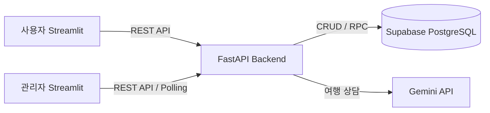

# ✈️ Airport — 항공권 예약 및 운영 관리 서비스

> 항공편 검색부터 좌석 예약, AI 여행 상담, 관리자 운영 관리까지 하나의 흐름으로 구현한 4인 팀 프로젝트입니다.

FastAPI와 Streamlit을 기반으로 사용자용 항공권 예약 서비스와 관리자용 운영 관리 서비스를 구현했습니다.  
Supabase PostgreSQL에 데이터를 저장하고 Gemini API를 활용한 AI 여행 도우미 기능을 연동했습니다.

---

## 🚀 Live Demo

> 프로젝트 종료 후 포트폴리오 및 기능 시연을 위해 개인 계정으로 별도 배포했습니다.

| 서비스 | 주요 기능 | 링크 |
|---|---|---|
| 👤 사용자 서비스 | 항공편 검색·예약, 내 예약, AI 여행 도우미 | [사용자 앱 실행하기](https://airline-reservation-team-project-gvscqmz5o5ofdshzcpzdr2.streamlit.app) |
| 🛠️ 관리자 서비스 | 운영 대시보드, 항공편·예약·이벤트 관리 | [관리자 앱 실행하기](https://airline-reservation-team-project-kuwpe6trar7hpjjoxwwgtw.streamlit.app/) |

**관리자 데모 계정**

```text
ID: admin@skyops.dev
PW: admin1234
```

> 팀 프로젝트 당시 배포 담당 역할에는 참여하지 않았으며, 프로젝트 종료 후 포트폴리오 정리 과정에서 Render와 Streamlit Community Cloud를 이용해 개인적으로 배포 환경을 구성했습니다.

---

## 🎬 프로젝트 한눈에 보기


---

## 📌 프로젝트 정보

| 구분 | 내용 |
|---|---|
| 프로젝트 | 항공권 예약 및 운영 관리 서비스 |
| 형태 | 4인 팀 프로젝트 |
| Frontend | Streamlit |
| Backend | FastAPI |
| Database | Supabase PostgreSQL |
| AI | Google Gemini API |
| Deploy | Render, Streamlit Community Cloud |

### 핵심 기능

**사용자**

- 회원가입·로그인
- 항공편 검색 및 좌석 조회
- 좌석 선택 및 예약
- 내 예약 조회·취소
- 프로필 관리
- Gemini 기반 AI 여행 상담
- 서비스 및 챗봇 답변 평가

**관리자**

- 관리자 인증 및 권한 검증
- 운영 지표 확인
- 항공편·좌석·예약·사용자 관리
- 이벤트 로그 조회
- 서비스 피드백 및 챗봇 평가 확인
- 운영 모니터 자동 갱신

---

## 🙋 담당 역할

프로젝트 아이디어 제안과 초기 설계부터 백엔드 작업, 구현 결과 검토, 협업 문제 해결, 문서화까지 프로젝트 전반에 참여했습니다.

### Backend

- 담당 범위의 FastAPI 백엔드 기능 구현
- 구현된 API 및 서비스 동작 테스트
- 프로젝트 진행 중 전체 기능을 실행하며 수정·보강이 필요한 부분 확인

### Project Planning & Collaboration

- 항공권 예약 및 AI 여행 도우미 서비스 아이디어 제안
- 프로젝트 전체 기능과 구현 방향을 정리한 `plan.md` 작성
- 팀원들이 동일한 기준으로 작업할 수 있도록 기능 범위와 완료 기준 정리
- 구현 결과를 직접 실행하며 수정이 필요한 부분 검토 및 전달
- 팀원 Git 브랜치 충돌 발생 시 원인 확인 및 해결 지원
- 프로젝트 후반 기능 및 산출물 검토

### Documentation

프로젝트의 기획과 구현 결과를 문서로 정리했습니다.

- 프로젝트 계획서 (`plan.md`)
- API 설계서
- 화면 설계서
- 데이터베이스 설계서
- 관리자 대시보드 구현 결과 문서
- 프로젝트 README
- README 시연 GIF 직접 제작

> 데이터베이스 구현 자체를 담당한 것은 아니며, 구현된 데이터 구조와 프로젝트 결과를 바탕으로 데이터베이스 설계 문서를 정리했습니다.

---

## 🛠 기술 스택

| 영역 | 기술 | 적용 |
|---|---|---|
| Frontend | Streamlit, Pandas | 사용자·관리자 UI, 데이터 표시 |
| Backend | Python, FastAPI, Uvicorn | REST API 및 비즈니스 로직 |
| Validation | Pydantic | 요청 데이터 검증 |
| Database | Supabase PostgreSQL | 관계형 데이터 저장 및 조회 |
| AI | Google Gemini API | AI 여행 상담 |
| Communication | HTTPX, SSE | API 통신 및 이벤트 스트림 |
| Test | Pytest | 주요 API 동작 테스트 |
| Deploy | Render, Streamlit Community Cloud | 백엔드 및 사용자·관리자 서비스 배포 |

---

## 🏗 서비스 구조



기본적인 요청 흐름은 다음과 같습니다.

```text
Streamlit
   ↓
API Client
   ↓
FastAPI Router
   ↓
Pydantic Schema
   ↓
Service
   ↓
Supabase PostgreSQL
```

HTTP 요청 처리, 데이터 검증, 비즈니스 로직을 분리하기 위해 백엔드를 Router → Schema → Service 구조로 구성했습니다.

---

## 🔍 주요 구현 내용

### 1. 사용자·관리자와 백엔드 API 연동

사용자와 관리자 Streamlit 화면이 FastAPI 백엔드 API를 통해 데이터를 조회하고 변경하도록 구성했습니다.

프론트엔드가 데이터베이스에 직접 접근하지 않고 백엔드를 거치도록 하여 화면, API, 데이터 처리의 역할을 분리했습니다.

### 2. 예약 및 좌석 관리

사용자가 항공편과 잔여 좌석을 확인하고 좌석을 선택하여 예약할 수 있도록 구현했습니다.

예약 생성·조회·취소와 관리자 예약 관리 기능을 하나의 서비스 흐름으로 연결했습니다.

### 3. 인증·권한 및 예외 처리

사용자와 관리자의 역할을 구분하고 인증 상태에 따라 접근 가능한 기능을 분리했습니다.

입력값 오류, 인증 실패, 존재하지 않는 데이터, 예약 충돌 등의 상황에서 적절한 오류를 반환하도록 구성했습니다.

### 4. 이벤트 로그 및 사용자 피드백

주요 서비스 이벤트를 기록하여 관리자 화면에서 확인할 수 있도록 구성했습니다.

서비스 피드백과 AI 챗봇 답변 평가도 저장하여 관리자 화면에서 확인할 수 있도록 구현했습니다.

---

## 🎥 주요 기능 시연

### 사용자 항공권 검색 및 예약


### 관리자 운영 및 이벤트 모니터링


### AI 상담 및 답변 품질 관리


---

## 📂 프로젝트 구조

```text
airline-reservation-team-project/
├─ backend/
│  ├─ app/
│  ├─ sql/
│  ├─ static/
│  └─ tests/
│
├─ frontend_user/
│  ├─ app_pages/
│  ├─ clients/
│  ├─ components/
│  └─ core/
│
├─ frontend_admin/
│  ├─ app_pages/
│  ├─ components/
│  └─ core/
│
├─ docs/
│  └─ dy/
│
├─ plan.md
├─ pytest.ini
├─ requirements.txt
└─ README.md
```

---

## 📑 설계 및 산출물

프로젝트의 기획부터 구현 결과까지 확인할 수 있도록 관련 문서를 함께 정리했습니다.

- [API 설계서](docs/dy/api-spec.md)
- [화면 설계서](docs/dy/screen-design.md)
- [데이터베이스 설계서](docs/dy/database-design.md)
- [관리자 대시보드 구현 결과](docs/dy/dashboard-result.md)
- [백엔드 통합 가이드](docs/dy/integration-guide.md)
- [프로젝트 계획서](plan.md)

---

## 🔧 Troubleshooting

프로젝트 종료 후 개인 배포 환경을 구성하는 과정에서 관리자 로그인 시 `500 Internal Server Error`가 발생했습니다.

Render 로그를 기반으로 문제를 추적하여 기존 Supabase 프로젝트가 삭제되어 백엔드의 DB 연결이 실패하고 있음을 확인했습니다.  
새 Supabase 환경에 데이터베이스를 복구하고 Render 환경변수를 재설정하여 사용자·관리자 서비스를 정상화했습니다.

👉 [상세 문제 분석 및 해결 과정 - 기술 블로그](https://velog.io/@jbbdyee/500-%EC%97%90%EB%9F%AC%EC%9D%98-%EC%9B%90%EC%9D%B8%EC%9D%80-%EC%82%AC%EB%9D%BC%EC%A7%84-Supabase%EC%98%80%EB%8B%A4)

## 📝 프로젝트 회고

프로젝트를 진행하며 경험한 협업 과정과 이전 프로젝트에서 만든 Plan Template을 실제 팀 프로젝트에 적용한 경험을 정리했습니다.

👉 [두 번째 팀 프로젝트가 덜 어려웠던 이유](https://velog.io/@jbbdyee/%ED%8C%80-%ED%94%84%EB%A1%9C%EC%A0%9D%ED%8A%B8%EA%B0%80-%EB%91%90-%EB%B2%88%EC%A7%B8%EC%97%94-%EB%8D%9C-%EC%96%B4%EB%A0%A4%EC%9B%A0%EB%8D%98-%EC%9D%B4%EC%9C%A0)

---

## 💡 프로젝트를 통해 배운 점

이번 프로젝트에서는 기능 구현뿐 아니라 **기획 → 구현 → 검토 → 협업 → 문서화**로 이어지는 팀 프로젝트의 전체 흐름을 경험했습니다.  
이전 협업 경험을 통해 초기 계획의 중요성을 느껴 이번 프로젝트에서는 구현 전에 `plan.md`에 기능 범위와 완료 기준을 구체적으로 정리했습니다.   
팀원들이 이를 공통 기준으로 활용하면서 구현 방향을 맞추는 데 도움이 되었습니다.  
또한 계획한 기능과 실제 구현 결과가 항상 동일하지는 않기 때문에, 구현된 기능을 직접 실행하고 수정이 필요한 부분을 다시 확인하는 과정의 중요성을 배웠습니다.  
프로젝트 종료 후에는 개인 배포 환경을 다시 구성하면서 프론트엔드, 백엔드, 데이터베이스의 연결 관계를 직접 확인하고 배포 환경에서 발생한 오류를 추적하는 경험도 할 수 있었습니다.

---

## 📎 참고

이 저장소는 팀 프로젝트 결과물을 개인 포트폴리오 목적으로 정리한 저장소입니다.  
프로젝트의 기능 구현은 팀원들과 함께 진행했으며, 위 `담당 역할`에는 제가 직접 수행하거나 참여한 내용을 기준으로 작성했습니다.

[팀프로젝트 주소 바로가기](https://github.com/encore-ai-campus/aio-01-p1-team5)
