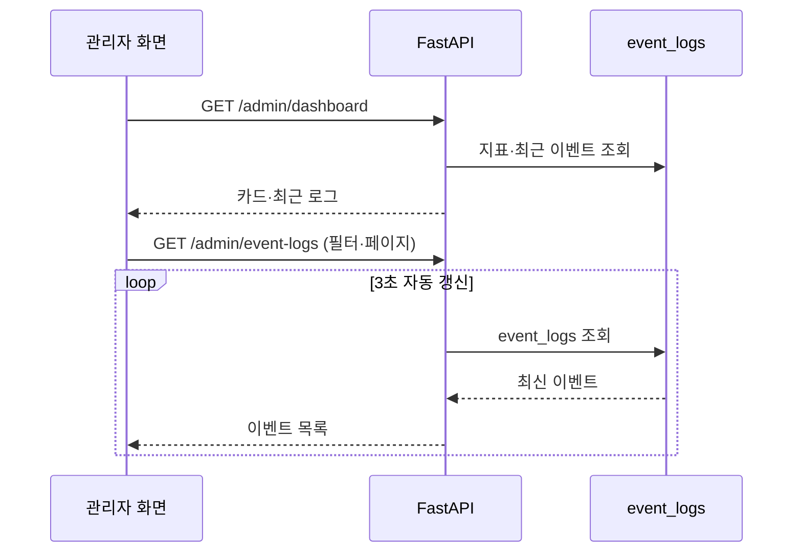

# 관리자 대시보드 구현 결과

- 담당·취합: dy
- 기준 코드: 백엔드 `admin_schema.py`, `admin_service.py`, `admin_router.py`, `event_service.py`; 프런트엔드 `02_dashboard.py`, `07_realtime_monitor.py`, `08_feedback_management.py`
- 상태: 백엔드 집계·이벤트 API와 최종 관리자 Streamlit 화면 대조·연동 완료

## 1. 제공 지표

| 영역 | 지표 | 산출 기준 |
|---|---|---|
| 항공편 | 전체, 예정, 지연, 결항, 출발 | 현재 `flights.status` |
| 예약 | 전체, 확정, 취소 | 전체 또는 API 요청 기간의 `bookings.created_at` |
| 매출 | 확정 매출 | `CONFIRMED` 예약의 `total_price` 합계 |
| 챗봇 | 평균 평점, 1~5점 건수, 전체·저평점 건수, 저평점 비율 | 전체 또는 API 요청 기간의 `category=CHATBOT` |
| 이벤트 | 최근 이벤트 | 대시보드의 최신 `event_logs` 최대 10건 |

API: `GET /admin/dashboard?start_at=...&end_at=...`

응답은 `data.flights`, `data.bookings`, `data.chat_feedbacks`,
`data.recent_events`의 중첩 구조를 사용한다. 프런트엔드는 평면 필드가 아니라 아래
예시의 경로로 카드 값을 읽는다.

백엔드 API는 `start_at`, `end_at` 기간 필터를 지원한다. 현재 관리자 대시보드
화면은 두 파라미터를 전달하지 않아 전체 기간을 조회하고, 피드백 관리 화면과
실시간 모니터는 각 화면에서 선택한 기간을 API에 전달한다.

## 2. 응답 구조 예시

다음 값은 응답 구조를 설명하기 위한 예시이며 실제 운영 수치는 DB 데이터에 따라
달라진다.

```json
{
  "flights": {
    "total": 4,
    "scheduled": 2,
    "delayed": 1,
    "cancelled": 1,
    "departed": 0
  },
  "bookings": {
    "total": 3,
    "confirmed": 2,
    "cancelled": 1,
    "confirmed_revenue": 154000
  },
  "chat_feedbacks": {
    "average_rating": 3.0,
    "rating_counts": {"1": 1, "2": 1, "3": 0, "4": 1, "5": 1},
    "total_count": 4,
    "low_rating_count": 2,
    "low_rating_ratio": 0.5
  },
  "recent_events": ["최신 이벤트 최대 10건"]
}
```

## 3. 실제 화면 구성

- 주요 지표: 전체 항공편, 운항 예정, 확정 예약, 확정 예약 매출, 챗봇 평균 평점
- 운항 현황: 예정·지연·결항·출발 막대그래프와 상태별 수치
- 예약 현황: 전체·확정·취소 수치와 막대그래프
- 챗봇 평가: 평균 평점, 전체 평가, 저평점 건수·비율, 1~5점 분포
- 최근 이벤트: 유형, 관련 리소스·항공편·예약·처리자 ID, 발생 시각, payload 상세
- 실시간 모니터: 이벤트 유형·항공편·예약·기간 필터, 페이지 조회, 3초 자동 갱신
- 피드백 관리: 일반 의견 목록·상세와 챗봇 저평점 상담 필터·상세·개선 분류 저장

## 4. 이벤트 갱신 흐름



백엔드는 별도로 `GET /events/stream` SSE를 제공하며 15초 heartbeat와
`Last-Event-ID` 재연결을 지원한다. 현재 Streamlit 실시간 모니터는 브라우저의
SSE 직접 구독 대신 `st.fragment(run_every=3.0)`으로 이벤트 로그 API를 다시
조회한다. 따라서 백엔드의 SSE 제공 여부와 현재 관리자 UI의 갱신 방식은 구분한다.

## 5. 검증 코드

| 검증 | 테스트 |
|---|---|
| 항공편·예약·매출·챗봇·최근 이벤트 통합 | `test_admin.py` |
| 기간의 UTC 변환과 지표별 동일 적용 | `test_admin.py` |
| 로그 필터·상세·페이지 | `test_events.py` |
| SSE cursor·heartbeat·연결 종료 | `test_events.py` |
| SSE 인증·재연결 헤더·프록시 설정 | `test_event_router.py` |
| 관리자 대시보드 권한과 응답 | `test_admin_router.py` |

현재 저장소에는 위 백엔드 테스트와 `frontend_admin/tests/test_demo_store.py`가
포함되어 있다. 통과 수는 테스트 추가에 따라 달라질 수 있으므로 문서에 고정하지
않고 최종 제출 환경에서 실행한 테스트 리포트를 검증 근거로 사용한다.

## 6. 초안 요구사항 대비 구현 결과

- 운영 지표·운항·예약·챗봇·최근 이벤트 영역을 대시보드에 구현했다.
- 지연·결항은 운항 그래프와 상태 수치로, 취소 예약은 예약 그래프와 수치로 표시한다.
- 최근 이벤트 목록과 선택 이벤트 payload 상세를 제공한다.
- 관리자 실시간 모니터는 SSE 카드 부분 갱신 대신 3초 polling과 수동 새로고침을 제공한다.
- 대시보드 카드 클릭 이동 대신 피드백 관리 화면에서 기본 1·2점 필터, 상담 상세, 문제 유형과 개선 메모 저장을 제공한다.
- 실시간 모니터의 날짜 입력은 KST 기준 범위를 offset 포함 값으로 만들며, 이벤트 클라이언트가 화면 표시 시간대를 변환한다.

## 7. 최종 확인 및 제출 자료

- [x] 관리자 대시보드에서 실제 `/admin/dashboard` API 연결
- [x] 이벤트 로그 목록·상세 API와 3초 자동 갱신 연결
- [x] 일반 피드백 및 챗봇 저평점 상세·개선 분류 저장 연결
- [ ] 신규 예약·취소·지연 상태 변경 실시간 시연
- [ ] 실행 화면 캡처 삽입
- [ ] 실제 Supabase 데이터와 지표 수동 대조

미체크 항목은 기능 구현 누락이 아니라 최종 발표·배포 환경에서 확보할 시연 및
검증 자료다.
