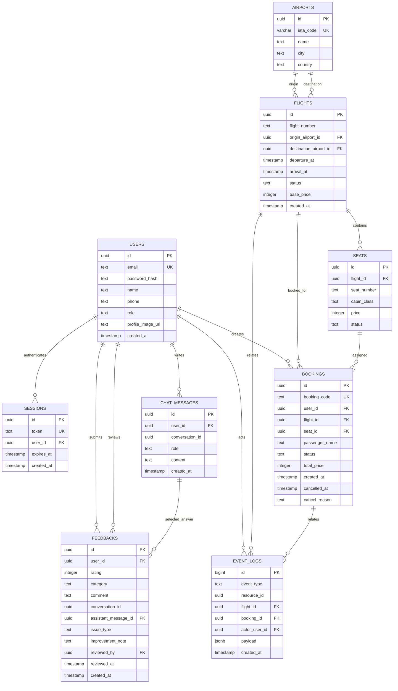

# 항공권 예약 서비스 데이터베이스 설계서

- 작성·검수: dy
- 실제 스키마 소유자: dn
- 기준: `backend/sql/dn/schema.sql`, `backend/sql/dy/add_booking_cancel_reason.sql`, `backend/sql/dy/booking_rpcs.sql`
- DB: PostgreSQL/Supabase
- 상태: 최종 저장소 SQL·백엔드 서비스·프론트엔드 사용 필드 대조 완료

## 1. ERD

## 2. 테이블·제약조건 요약

| 테이블 | 핵심 제약조건 | 주요 인덱스 |
|---|---|---|
| `users` | email UNIQUE, role USER/ADMIN | email UNIQUE |
| `airports` | IATA 3자리 UNIQUE | iata_code UNIQUE |
| `flights` | 다른 출도착 공항, 도착>출발, 양수 운임, 상태 CHECK | 출발지+도착지+출발시각 |
| `seats` | `(flight_id, seat_number)` UNIQUE, 등급·상태 CHECK, 양수 가격 | 복합 UNIQUE |
| `bookings` | 예약번호 UNIQUE, 좌석·항공편 복합 FK, 상태 CHECK, 양수 금액, 취소 사유 저장 | user_id, 활성 seat 부분 UNIQUE |
| `event_logs` | 이벤트 유형 CHECK, payload JSONB | 유형+시각, flight_id, booking_id |
| `feedbacks` | 평점 1~5, category/issue CHECK, 챗봇 평가일 때 상담·답변 연결값 필수, 상담당 1회 | 평점+category, created_at |
| `chat_messages` | role USER/ASSISTANT | conversation_id |
| `sessions` | token UNIQUE | user_id, expires_at |

## 3. 예약 무결성

다음 장치를 함께 사용한다.

1. `seats(id, flight_id)`와 `bookings(seat_id, flight_id)` 복합 FK로 다른 항공편 좌석 연결을 차단한다.
2. `ux_bookings_active_seat` 부분 UNIQUE 인덱스로 좌석당 활성 예약을 하나로 제한한다.
3. RPC에서 좌석 행을 `FOR UPDATE`로 잠가 동시에 들어온 예약을 직렬화한다.
4. 예약 INSERT, 좌석 상태, 이벤트 로그를 같은 PostgreSQL 함수 트랜잭션에서 처리한다.

| RPC | 원자 처리 |
|---|---|
| `create_booking_atomic` | 예약 가능 확인 → 예약 생성 → 좌석 BOOKED → 로그 |
| `cancel_booking_atomic` | 소유권·취소 가능 확인 → 예약 CANCELLED·취소 사유 저장 → 좌석 AVAILABLE → 로그 |
| `set_booking_status_atomic` | 관리자 상태 변경 → 좌석 충돌 확인·갱신 및 취소 사유 처리 → 로그 |

## 4. 상태값

| 대상 | 값 |
|---|---|
| 사용자 역할 | `USER`, `ADMIN` |
| 항공편 | `SCHEDULED`, `DELAYED`, `CANCELLED`, `DEPARTED` |
| 좌석 | `AVAILABLE`, `HELD`, `BOOKED` |
| 예약 | `CONFIRMED`, `CANCELLED` |
| 이벤트 | `FLIGHT_STATUS_CHANGED`, `SEAT_CHANGED`, `BOOKING_CHANGED` |
| 피드백 | `SERVICE`, `SEARCH`, `BOOKING`, `CHATBOT`, `ETC` |
| 개선 분류 | `INACCURATE`, `MISUNDERSTOOD`, `INSUFFICIENT`, `SLOW`, `ETC` |

## 5. 시간·보안 규칙

- 모든 `timestamp` 값은 애플리케이션에서 UTC로 변환해 저장하고 화면에서 KST로 표시한다.
- 비밀번호는 bcrypt hash만 저장하며 세션 토큰·비밀번호를 로그에 남기지 않는다.
- 백엔드는 service role key를 사용하므로 API 인증·소유권 검사가 필수이다.
- 운영 환경의 업로드 파일은 재시작 시 손실될 수 있는 로컬 디스크 대신 Supabase Storage로 이전한다.

## 6. 최종 대조 결과와 향후 개선 항목

| 항목 | 현재 상태 | 조치 |
|---|---|---|
| `flights` 중복 편성 | Service에서 편명+출발시각 중복 검사, DB UNIQUE는 없음 | 필요 시 DB UNIQUE 제약 추가 검토 |
| timestamp 타입 | `timestamp`이며 애플리케이션에서 UTC 변환 | 운영 고도화 시 `timestamptz` 전환 검토 |
| 일반 의견 컬럼명 | DB와 API의 기준 필드는 `comment` | 관리자 클라이언트는 이전 `content` 응답도 호환 |
| 챗봇 답변 연결 | 일반 피드백에서는 nullable, `CHATBOT` 평가에서는 CHECK로 필수 | 선택한 AI 답변 ID를 저장 |
| 예약 취소 사유 | `bookings.cancel_reason`에 저장하고 이벤트 payload에도 포함 | 신규·기존 DB 적용 절차 구분 완료 |
| 예약 원자성 | 세 RPC가 좌석 잠금·예약·좌석·로그 변경을 트랜잭션으로 처리 | 실제 Supabase 배포 환경에서 최종 병렬 검증 필요 |

신규 DB는 `schema.sql`에 `cancel_reason`이 포함되어 있다. 기존 DB는
`add_booking_cancel_reason.sql`을 먼저 실행한 뒤 RPC를 갱신한다.

## 7. 최종 검수 체크리스트

- [x] 저장소 `schema.sql`의 테이블·컬럼·PK/FK/CHECK/인덱스 대조
- [x] 예약 RPC와 API Service 파라미터 대조
- [x] `cancel_reason` 컬럼·마이그레이션·RPC 대조
- [x] 피드백과 챗봇 답변 연결 제약 대조
- [ ] Supabase 개발 DB에서 테이블·함수 목록 확인
- [ ] 같은 좌석 병렬 예약 중 하나만 성공하는지 확인
- [ ] 예약 취소·재확정 후 좌석과 로그를 함께 확인

위 미체크 항목은 저장소 구현 누락이 아니라 실제 Supabase 배포 환경에서 수행할
운영 검증 항목이다.
