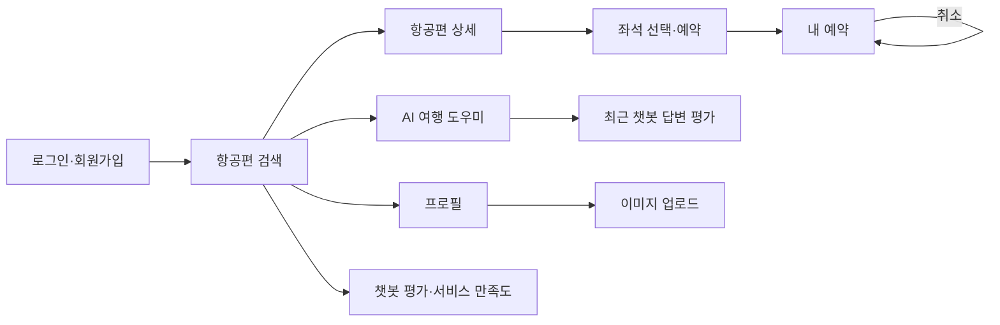
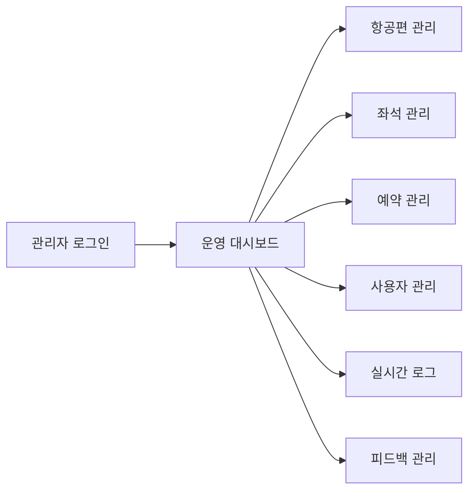

# 항공권 예약 서비스 화면 설계서

- 작성·취합: dy
- 기준: 최종 `frontend_user`, `frontend_admin`, `docs/dy/api-spec.md`
- 최초 작성일: 2026-08-07
- 상태: 사용자·관리자 Streamlit 구현 화면과 최종 대조 완료

## 1. 공통 원칙

- 사용자 앱과 관리자 앱은 별도 Streamlit 진입점을 사용한다.
- 인증 토큰과 사용자 역할은 Session State에 저장하되 화면이나 로그에 출력하지 않는다.
- API 오류는 `BackendAPIError`로 변환해 `message`를 사용자에게 표시한다.
- 시간은 화면별 클라이언트에서 필요한 API의 UTC 값을 KST로 변환해 표시한다.
- 인증 정보는 브라우저 저장소와 Session State를 동기화해 새로고침 후 복원한다.
- 관리자 실시간 모니터는 Streamlit fragment로 3초마다 이벤트 로그를 다시 조회하며 수동 새로고침도 제공한다.
- 백엔드는 SSE를 지원하지만 현재 화면은 SSE를 직접 구독하지 않는다.

## 2. 사용자 화면 흐름



### U-01 로그인·회원가입

| 항목 | 설계 |
|---|---|
| 목적 | 사용자 인증 후 서비스 진입 |
| 입력 | 이메일, 비밀번호, 회원가입 시 이름 |
| 주요 동작 | 로그인, 회원가입 전환, 인증 성공 시 검색 화면 이동 |
| 검증 | 필수값, 이메일 형식, 비밀번호 정책, 중복 계정 |
| API | `POST /auth/signin`, `POST /auth/signup` |

```text
┌────────────────────────────────────┐
│ 항공권 예약                        │
│ [이메일                         ]  │
│ [비밀번호                       ]  │
│ [ 로그인 ]  [ 회원가입으로 전환 ] │
│ 오류 또는 성공 안내                │
└────────────────────────────────────┘
```

### U-02 항공편 검색

| 항목 | 설계 |
|---|---|
| 입력 | 출발 공항, 도착 공항, 출발일, 인원 1~9, 좌석 등급(전체·이코노미·비즈니스) |
| 정렬 | 가격 낮은 순, 가격 높은 순, 출발 시간 빠른 순 |
| 결과 | 편명, 노선, 출도착 KST, 상태, 최저가, 잔여 좌석 |
| 빈 결과 | 조건 변경 안내와 검색 폼 유지 |
| API | `GET /airports`, `GET /flights` |

```text
┌──────────────── 검색 조건 ─────────────────┐
│ 출발 [ICN ▼]  도착 [CJU ▼]  날짜 [       ]│
│ 인원 [1]      등급 [ECONOMY ▼] [검색]      │
├──────────────── 검색 결과 ─────────────────┤
│ KE1201  ICN → CJU  12:00~13:10             │
│ 89,000원 / 잔여 4석 / 예정       [상세]    │
└─────────────────────────────────────────────┘
```

### U-03 항공편 상세·좌석 선택

| 항목 | 설계 |
|---|---|
| 표시 | 항공편, 출도착지·시각, 출발일, 1인 요금, 예약 인원, 좌석 등급 |
| 좌석 상태 | 선택 가능, 임시 불가, 예약 완료를 텍스트와 색상으로 구분 |
| 동작 | 좌석 선택 후 탑승객명 입력 화면 이동 |
| 갱신 | 화면 진입 시 좌석 API를 조회하고 예약 충돌 시 최신 상태 재선택 안내 |
| API | `GET /flights/{id}/seats` |

### U-04 예약 확인

| 항목 | 설계 |
|---|---|
| 표시 | 선택 항공편·좌석·운임, 로그인 사용자 정보 |
| 입력 | 선택 인원 수만큼 탑승객명 |
| 동작 | 최종 예약, 409 발생 시 좌석 재선택 안내 |
| API | `POST /bookings` |

### U-05 내 예약

| 항목 | 설계 |
|---|---|
| 표시 | 예약번호, 편명, 노선, 좌석, 금액, 상태, 예약·취소 시각 |
| 조회 | 로그인 사용자의 예약을 한 번에 조회하여 카드 목록으로 표시 |
| 동작 | 확정 예약의 취소 사유 입력 및 예약 취소 |
| API | `GET /bookings/me`, `PUT /bookings/{id}/cancel` |

### U-06 AI 여행 도우미

| 항목 | 설계 |
|---|---|
| 채팅 | 사용자/AI 메시지 구분, 전송 중 상태, 외부 API 실패 안내 |
| 이동 | 대화 후 별도 `챗봇 평가` 화면으로 이동 |
| API | `POST /chat/messages` |

### U-07 프로필·이미지 업로드

| 항목 | 설계 |
|---|---|
| 표시·수정 | 이름, 프로필 이미지 |
| 사용자 화면 | JPEG·PNG 파일 선택과 미리보기 제공 |
| 백엔드 API | JPEG·PNG·WebP·GIF 허용, 최대 5MiB 검증 |
| API | `GET/PATCH /users/me`, `POST /uploads/images` |

### U-08 챗봇 평가·서비스 만족도

| 항목 | 설계 |
|---|---|
| 탭 | `챗봇 답변 평가`, `서비스 만족도` |
| 챗봇 평가 | 최근 질문·답변, 만족도 1~5, 2글자 이상 의견; 이미 평가한 답변은 완료 안내 |
| 서비스 만족도 | 만족도 1~5, 2글자 이상 의견; 카테고리는 `SERVICE`로 저장 |
| API | `POST /chat/feedbacks`, `POST /feedbacks` |

## 3. 관리자 화면 흐름



### A-01 관리자 로그인

- 일반 사용자 계정이면 403 안내 후 관리자 화면 진입을 차단한다.
- API: `POST /auth/signin`, 인증 후 관리자 권한 확인.

### A-02 운영 대시보드

```text
┌────────────── 운영 대시보드 ──────────────┐
│ 항공편 4 │ 확정 예약 2 │ 확정 매출 154,000│
│ 운항 예정 2 │ 챗봇 평균 평점 3.0          │
├────────────── 챗봇 품질 ──────────────────┤
│ 평균 3.0 │ 저평점 비율 50% │ 평가 4건     │
├────────────── 최근 이벤트 ────────────────┤
│ 시각 | 유형 | 항공편/예약 | 변경 내용      │
└────────────────────────────────────────────┘
```

| 동작 | API |
|---|---|
| 전체 기간 운영·품질 지표 | `GET /admin/dashboard` |
| 최근 이벤트 최대 10건과 payload 상세 | `GET /admin/dashboard` |

현재 대시보드는 기간 입력이나 카드 클릭 이동을 제공하지 않는다. 기간 필터는
백엔드 API가 지원하며 실시간 이벤트 조회는 별도 실시간 모니터 화면에서 수행한다.

### A-03 항공편 관리

- 목록/검색 영역과 생성·수정 Form을 분리한다.
- 항공편을 최대 100건 조회하고 편명 또는 노선 키워드로 화면에서 필터링한다.
- 별도의 운항 상태 필터와 페이지 이동 UI는 제공하지 않는다.
- 편명, 공항, 출도착 시각, 상태, 기본 운임을 입력한다.
- 삭제 409 시 연결된 좌석·예약 때문에 삭제할 수 없음을 표시한다.
- API: `GET /admin/flights`, `POST /flights`, `GET/PUT/DELETE /flights/{id}`.

### A-04 좌석 관리

- 항공편을 먼저 선택하고 좌석번호·등급·가격·상태를 관리한다.
- `BOOKED`는 예약 흐름에서만 설정됨을 안내한다.
- 예약 이력 좌석 수정·삭제 409를 표시한다.
- API: `GET/POST /flights/{id}/seats`, `PUT/DELETE /seats/{id}`.

### A-05 예약 관리

- 확정·취소 상태 필터와 예약 ID·탑승객 검색을 제공한다.
- 예약은 1페이지에서 최대 100건을 조회하며 별도 페이지 이동 UI는 제공하지 않는다.
- 예약을 선택하면 예약번호·승객·항공편·좌석·상태·금액·노선·일시를 표시한다.
- 변경 상태를 선택한 뒤 버튼으로 저장하며 별도 확인 Dialog는 사용하지 않는다.
- 상태 변경 중 좌석 충돌이 발생하면 409 오류 안내를 표시한다.
- API: `GET /admin/bookings`, `PUT /admin/bookings/{id}/status`.

### A-06 사용자 관리

- 이름·이메일 검색, 사용자 선택, `USER`·`ADMIN` 역할 변경을 제공한다.
- API: `GET /users?offset=...&limit=...`, `PATCH /users/{id}/role`.

### A-07 실시간 이벤트 로그

- 이벤트 유형, 기간, 항공편 ID, 예약 ID 조합 필터를 제공한다.
- 행 선택 시 `payload` 전체 JSON과 행위자·발생 시각을 표시한다.
- 3초 자동 갱신 toggle, 수동 새로고침, 페이지 크기·이전·다음 이동을 제공한다.
- 행 선택 시 상세 API를 호출해 payload 전체와 관련 ID를 표시한다.
- API: `GET /admin/event-logs`, `GET /admin/event-logs/{id}`.

### A-08 피드백 관리

- 한 화면에서 일반 서비스 의견과 챗봇 상담 평가를 함께 관리한다.
- 일반 의견은 평점·카테고리로 화면 내 필터링하고 상세 정보를 조회한다.
- 챗봇 영역은 작성 기간·평점(기본 1·2점)·의견 유무·대화 ID로 필터링한다.
- 평균 평점·저평점 비율·평점별 건수와 질문·답변·의견 상세를 표시한다.
- 1·2점 평가에는 실패 유형과 개선 메모 저장 폼을 제공한다.
- API: 일반 피드백 목록·상세 및 챗봇 요약·목록·상세·검토 API.

## 4. 화면 상태 표준

모든 목록·상세 화면은 다음 상태를 구현한다.

| 상태 | 표시 |
|---|---|
| 초기 | 검색 조건 또는 안내 문구 |
| 로딩 | spinner와 중복 클릭 방지 |
| 성공 | 결과와 성공 메시지 |
| 빈 결과 | 조건 변경 안내, 입력값 유지 |
| 401 | 세션 초기화 후 로그인 이동 |
| 403 | 권한 부족 안내 |
| 404 | 대상이 삭제되었음을 안내하고 목록 갱신 |
| 409 | 최신 좌석·예약 상태 재조회 후 행동 안내 |
| 422 | 해당 입력 필드 가까이에 검증 메시지 |
| 5xx | 잠시 후 재시도 및 관리자 문의 안내 |

## 5. 최종 대조 결과

- [x] 사용자 앱 8개 페이지와 입력명·이동 흐름 대조
- [x] 관리자 앱 8개 페이지와 필터·테이블·상세 흐름 대조
- [x] 관리자 이벤트 화면의 3초 polling 방식 반영
- [x] 대시보드 전체 기간 조회와 피드백 통합 관리 방식 반영
- [ ] 사용자·관리자 앱 실제 캡처 삽입
- [ ] 실제 실행 환경에서 KST 표시와 401 세션 초기화 확인

미체크 항목은 화면 설계 누락이 아니라 최종 실행·제출 자료 확인 항목이다.
