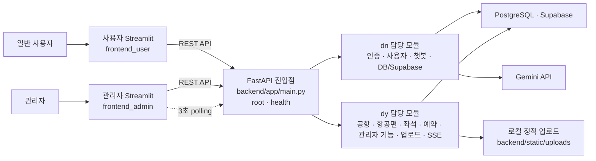

# 항공권 예약 프로그램 개발 계획서 (aio-01-p1-team5)

## 1. 프로젝트 개요

### 1-1. 프로젝트명

```text
실시간 항공권 검색·예약 및 AI 여행 도우미
```

### 1-2. 프로젝트 목표

> 항공권을 쉽고 빠르게 비교·예약하려는 사용자가 여러 페이지를 반복해서 새로고침해야 하는 불편을 줄이기 위해  
> 항공편 검색, 좌석 예약, 예약 관리, 실시간 상태 알림, AI 챗봇을 하나로 제공하는 웹 서비스를 개발한다.

본 프로젝트는 FastAPI와 Streamlit을 중심으로   
REST API, PostgreSQL(Supabase), 인증, 파일 업로드, 실시간 통신, Gemini API 등 지금까지 학습한 기술을 최대한 실제 서비스 흐름에 적용하는 것을 목표로 한다.

### 1-3. 주요 기능

- 회원가입, 로그인, 로그아웃 및 사용자 인증
- 출발지·도착지·날짜·인원·좌석 등급 기반 항공편 검색 및 정렬/필터링
- 항공편 상세 조회, 좌석 선택, 예약 생성 및 예약 취소
- 마이페이지에서 예약 내역을 조회·취소하고 사용자 이름과 프로필 이미지를 조회·수정
- 관리자용 항공편·좌석·운항 상태 CRUD
- 항공편·좌석·예약 변경 로그와 관리자 실시간 모니터의 3초 자동 갱신
- Gemini API 기반 항공권 검색·예약 안내 챗봇
- 챗봇 상담 종료 후 1~5점 평점과 의견 수집, 저평점 답변 분석을 통한 답변 품질 개선
- 프로필 이미지 업로드와 정적 파일 제공
- 공통 API Client와 `BackendAPIError`를 이용한 프론트엔드 예외 처리
- 항공편·좌석·예약 상태 변경 로그 생성·저장 및 관리자 로그 조회
- 사용자의 서비스 만족도·의견 피드백 저장 및 관리자 조회

### 1-4. 구현 범위

- 자체 회원가입·로그인·로그아웃, 비밀번호 해싱
- 샘플 항공편 데이터 구축
- 항공편 목록/상세 조회 및 조건 검색
- 좌석 재고 확인, 좌석 선택, 예약 생성·조회·취소
- 본인 예약만 조회/취소할 수 있는 권한 검사
- 관리자 항공편 CRUD 및 운항 상태 변경
- 백엔드 SSE 이벤트 스트림 제공과 관리자 실시간 모니터의 3초 주기 이벤트 로그 조회
- Gemini 챗봇을 통한 서비스 이용 안내 및 조건에 맞는 항공편 추천
- 이미지 파일 업로드 및 정적 파일 조회
- Streamlit 멀티 페이지, Sidebar, Navigation, Session State 적용
- 입력값 검증, 공통 오류 응답, 기본 수동/자동 테스트
- 이벤트 로그 목록·조건별 필터·상세 조회와 관리자 실시간 모니터 자동 갱신
- 로그인 사용자의 피드백 등록과 관리자 피드백 목록 조회

### 1-5. 4단계 최소 기능 구현 기준

| 최소 기능 | 프로젝트 적용 내용 | 담당자 | 완료 기준 |
|---|---|---|---|
| 로그 생성 또는 수집 | 항공편 상태 변경, 좌석 상태 변경, 예약 생성·취소 시 백엔드가 이벤트 로그를 생성한다. | 백엔드 2 (dy) | 각 핵심 이벤트 발생 시 유형, 대상 ID, JSON 데이터, 발생 시각이 생성된다. |
| 데이터베이스 저장 | 생성한 로그는 `event_logs`, 사용자 의견은 `feedbacks` 테이블에 저장한다. | 백엔드 1 (dn), 백엔드 2 (dy) | Supabase에서 저장 결과를 조회할 수 있고 실패 시 일관된 오류를 반환한다. |
| 로그 목록 조회 | 관리자가 이벤트 로그 목록과 단일 로그 상세를 조회한다. | 백엔드 2 (dy), 관리자 프론트엔드 (tk) | 페이지 단위 목록과 선택한 로그의 전체 JSON 데이터를 확인할 수 있다. |
| 이벤트 로그 자동 갱신 | 백엔드는 SSE 스트림을 제공하고 관리자 실시간 모니터는 이벤트 로그 API를 3초마다 다시 조회한다. | 백엔드 2 (dy), 관리자 프론트엔드 (tk) | 별도 수동 새로고침 없이 신규 이벤트가 실시간 모니터 목록에 반영된다. |
| 조건별 필터와 상세 조회 | 이벤트 유형, 기간, 항공편, 예약 ID로 로그를 필터링하고 상세 내용을 조회한다. | 백엔드 2 (dy), 관리자 프론트엔드 (tk) | 조건 조합에 맞는 결과만 표시되고 존재하지 않는 로그는 404로 처리된다. |
| 사용자 피드백 저장 | 로그인 사용자가 만족도와 의견을 등록하고 관리자가 목록을 조회한다. | 백엔드 2 (dy), 사용자 프론트엔드 (dh), 관리자 프론트엔드 (tk) | 피드백이 사용자 ID와 작성 시각을 포함해 DB에 저장되고 관리자 화면에 표시된다. |

### 1-6. 챗봇 답변 품질 개선

챗봇 상담이 끝난 뒤 사용자가 최근 챗봇 답변에 대해 1~5점 평점과 의견을 남길 수 있도록 한다. 관리자는 저평점 상담을 우선 확인하고 실제 사용자 질문, AI 답변, 평점, 의견을 함께 분석한다.

```text
사용자와 Gemini 챗봇 상담
→ 상담 종료 버튼 선택
→ 최근 챗봇 답변 평가 화면에서 1~5점 평점과 2글자 이상 의견 입력
→ 대화·답변 ID와 함께 feedbacks 테이블에 저장
→ 관리자 화면에서 1~2점 저평점 상담 우선 조회
→ 반복되는 실패 유형 분류
→ 시스템 프롬프트·FAQ·검색 조건 안내 문구 개선
→ 동일 질문 테스트 후 변경 이력 기록
```

#### 사용자 기능

- 챗봇 화면에 `상담 종료` 버튼과 `최근 챗봇 답변 평가하기` 이동 링크를 제공한다.
- 프론트엔드는 1~5점 평점과 공백 제외 2글자 이상 의견을 요구한다.
- API는 평점을 필수로 검증하고 `comment`는 선택값으로 허용한다.
- 한 상담에는 한 번만 평가할 수 있으며 제출 완료 여부를 표시한다.
- 현재 화면은 최근 AI 답변을 평가 대상으로 사용하고 해당 상담·답변 ID를 함께 저장한다.

#### 관리자 기능

- 전체 챗봇 평가의 평균 평점과 평점별 건수를 대시보드에 표시한다.
- 기본 필터로 1~2점 저평점 상담을 우선 조회한다.
- 평점, 작성 기간, 의견 유무, 대화 ID로 필터링한다.
- 상세 화면에서 사용자 질문, AI 답변, 평점, 사용자 의견을 함께 확인한다.
- 저평점 원인을 `부정확`, `질문 이해 실패`, `정보 부족`, `응답 지연`, `기타`로 분류하고 개선 메모를 남긴다.

#### 답변 개선 원칙

- 사용자 피드백이 Gemini 모델을 자동으로 재학습시키지는 않는다.
- 관리자가 저평점 사례를 검토해 시스템 프롬프트, FAQ 문맥, 답변 제한 규칙과 검색 안내를 수정한다.
- 수정 전·후 동일 질문을 테스트하고 평균 평점, 저평점 비율, 반복 실패 유형의 변화를 비교한다.
- 사용자 개인정보와 전체 대화 내용은 필요한 범위에서만 조회하며 로그와 개선 문서에는 마스킹한다.


> 백엔드는 FastAPI의 SSE(Server-Sent Events)와 재연결 cursor를 제공한다.
> 현재 Streamlit 관리자 실시간 모니터는 SSE를 직접 구독하지 않고 3초마다 이벤트 로그 API를 조회하며, 사용자 화면도 SSE를 직접 연결하지 않는다.

---

## 2. 기능별 완료 기준

| 기능                | 담당자                                         | 완료 기준                                                                                                |
| ------------------- | ---------------------------------------------- | -------------------------------------------------------------------------------------------------------- |
| 회원가입·인증       | 백엔드 1, 사용자 프론트엔드, 관리자 프론트엔드 | 사용자 회원가입·로그인과 관리자 로그인이 동작하고 역할에 따라 화면과 API 접근이 제한된다.                |
| 항공편 검색         | 백엔드 2, 사용자 프론트엔드                    | 출발지·도착지·출발일·인원 조건으로 조회되고 가격/시간 정렬과 빈 결과 안내가 동작한다.                    |
| 항공편·좌석 CRUD    | 백엔드 2, 관리자 프론트엔드                    | 관리자가 항공편과 좌석 정보를 생성·조회·수정·삭제하고 변경 결과가 DB에 반영된다.                         |
| 예약 생성·조회·취소 | 백엔드 2, 사용자 프론트엔드                    | 로그인 사용자가 잔여 좌석을 예약하고 본인의 예약 내역을 조회·취소할 수 있다.                             |
| 동시 예약 방지      | 백엔드 2                                       | 같은 좌석에 대한 중복 예약 요청 중 하나만 성공하고 좌석 재고가 음수가 되지 않는다.                       |
| 이벤트 자동 갱신    | 백엔드 2, 관리자 프론트엔드                    | 백엔드는 SSE를 제공하고 관리자 실시간 모니터는 3초 polling으로 신규 이벤트를 자동 조회한다.              |
| AI 챗봇             | 백엔드 1, 사용자 프론트엔드                    | Gemini가 서비스 이용법과 검색 조건에 답하며, 상담 종료 후 1~5점 평가 화면으로 연결된다.                  |
| 이미지 업로드       | 백엔드 2, 사용자 프론트엔드                    | 허용된 프로필 이미지만 업로드되고 업로드 결과를 정적 URL로 확인할 수 있다.                               |
| 이벤트 로그 조회    | 백엔드 2, 관리자 프론트엔드                    | 로그 목록·조건별 필터·상세 조회가 동작하고 새 로그가 실시간 모니터에 자동 반영된다.                       |
| 사용자 피드백       | 백엔드 2, 사용자·관리자 프론트엔드             | 일반 의견과 챗봇 상담 평점·의견을 저장하고 관리자가 저평점 질문·답변을 조회할 수 있다.                    |
| 입력값·예외 처리    | 전체                                           | 필수값, 형식 오류, 인증 실패, 권한 없음, 미존재 데이터, 외부 API 실패에 일관된 안내를 제공한다.          |
| 프로젝트 통합       | 전체                                           | FastAPI, Streamlit, Supabase, Gemini, SSE가 한 환경에서 실행되고 핵심 사용자 시나리오가 끝까지 동작한다. |

---

## 3. 팀원별 역할 및 수정 범위

| 담당자                 | 담당 기능                                                           | 생성·수정 파일                                                                                                               | 공통 파일 수정 여부    | 완료 조건                                                           |
| ---------------------- | ------------------------------------------------------------------- | ---------------------------------------------------------------------------------------------------------------------------- | ---------------------- | ------------------------------------------------------------------- |
| 백엔드 1 (dn)          | 공통 기반 관리, 인증·권한, 사용자, Gemini 연동, Supabase/DB         | `main.py`, `config.py`, `security.py`, `dependencies.py`, `supabase_client.py`, `schema.sql`, 인증·사용자·챗봇 Router/Schema/Service | 있음(소유자)           | 인증·권한·사용자·챗봇 API, DB 연결과 담당 테스트가 정상 동작        |
| 백엔드 2 (dy)          | 공항 조회, 항공편·좌석·예약 관리, 로그·피드백, 관리자 대시보드, 업로드, SSE 이벤트 | `api_response.py`, `docs/dy/api-spec.md`, 공항 조회·항공편·좌석·예약·로그·피드백·관리자·업로드·이벤트 Router/Schema/Service | 있음(소유자) | 항공편·좌석 CRUD, 예약/취소, 로그 조회, 피드백 저장, 업로드, SSE가 정상 동작 |
| 사용자 프론트엔드 (dh) | 일반 사용자용 Streamlit 앱 전체                                     | `frontend_user/app.py`, `clients/`, `components/`, `app_pages/` 전체                                                         | 있음(사용자 앱 소유자) | 회원가입→검색→좌석→예약→내역/취소와 챗봇·프로필 흐름 완료           |
| 관리자 프론트엔드 (tk) | 관리자용 Streamlit 앱 전체                                          | `frontend_admin/app.py`, `clients/`, `components/`, `app_pages/` 전체                                                        | 있음(관리자 앱 소유자) | 관리자 로그인, 대시보드, 항공편·좌석·예약 관리와 실시간 모니터 완료 |

### 담당자별 세부 범위

#### 백엔드 1 (dn)

- FastAPI 실행 구조와 Router 등록을 관리한다.
- 회원가입·로그인·로그아웃, 사용자/관리자 권한을 구현한다.
- 사용자 조회·수정, Supabase 연결, DB 스키마와 초기 데이터를 관리한다.
- Gemini 챗봇 API와 외부 API 오류 처리를 구현한다.
- `test_auth.py`, `test_users.py`를 중심으로 담당 기능을 검증한다.

#### 백엔드 2 (dy)
- 검색 조건 입력에 필요한 공항 목록 조회와 항공편 검색·상세·관리자 CRUD를 구현한다.
- 좌석 조회·관리, 예약 생성·조회·취소를 구현한다.
- 트랜잭션과 UNIQUE 제약으로 동일 좌석의 중복 예약을 방지한다.
- 이미지 업로드와 StaticFiles 제공을 구현한다.
- SSE 이벤트와 `event_logs` 저장을 구현하고 관리자·공항 조회·항공편·좌석·예약 테스트를 담당한다.
- 이벤트 로그 목록·조건별 필터·상세 조회와 사용자 피드백 저장·관리자 조회를 구현한다.
- 챗봇 상담 평점과 특정 답변 연결 정보를 저장하고 저평점 상담 조회·분류 API를 구현한다.

#### 사용자 프론트엔드 (dh)

- 사용자 앱의 실행 구조, API Client, `BackendAPIError`, Session State를 관리한다.
- 회원가입/로그인, 항공편 검색/상세, 좌석 선택, 예약을 구현한다.
- 내 예약 조회/취소, 사용자 이름·프로필 이미지 수정, Gemini 챗봇을 구현한다.
- 서비스 만족도 탭에서 1~5점과 2글자 이상 의견을 받고 `SERVICE` 카테고리로 저장한다.
- 챗봇 상담 종료 후 최근 답변에 1~5점과 2글자 이상 의견을 남기는 평가 UI를 구현한다.
- 항공편 상세 진입과 예약 충돌 시 API를 다시 조회하고, 예약·취소 결과는 현재 세션의 상태 안내로 표시한다.

#### 관리자 프론트엔드 (tk)

- 관리자 앱의 실행 구조, API Client, `BackendAPIError`, Session State를 관리한다.
- 관리자 로그인과 권한 차단, 운영 대시보드를 구현한다.
- 항공편·좌석·예약 관리 화면을 구현한다.
- 운항 상태를 변경하고 예약/취소/좌석 변경 이벤트를 실시간 모니터에서 3초마다 자동 조회한다.
- 이벤트 로그 필터·상세 화면과 사용자 피드백 목록·상세 화면을 구현한다.
- 챗봇 평균 평점·저평점 비율 대시보드와 저평점 질문·답변·의견 상세 화면을 구현한다.

### 필수 산출물 담당

필수 산출물은 아래 담당자가 작성·취합하고, 기능 담당자는 필요한 명세와 구현 자료를 제공한다.   
내용이 변경되면 담당자에게 즉시 공유하여 구현 결과와 문서를 일치시킨다.

| 필수 산출물          | 담당자 | 포함 내용                                                                        | 완료 기준                                                                              |
| -------------------- | ------ | -------------------------------------------------------------------------------- | -------------------------------------------------------------------------------------- |
| API 설계 문서        | dy     | 엔드포인트, HTTP 메서드, 인증 여부, 요청값, 응답 JSON, 상태 코드, 오류 코드      | 사용자·관리자 프론트엔드와 백엔드가 동일한 명세로 연동하고 최종 API가 문서와 일치한다. |
| 화면 설계서          | dy     | 사용자·관리자 화면 목록, 와이어프레임, 화면 이동 흐름, 주요 컴포넌트와 입력 항목 | 모든 필수 화면과 사용자 흐름이 포함되고 실제 구현 화면과 차이가 없다.                  |
| 데이터베이스 설계서  | dy     | ERD, 테이블·컬럼, PK/FK, 데이터 타입, 제약조건, 관계, 상태값                     | 실제 PostgreSQL/Supabase 스키마와 설계서가 일치하고 팀 검토가 완료된다.                |
| 대시보드 구현 결과물 | dy     | 관리자 대시보드 화면, 주요 지표, 실시간 이벤트 로그, 챗봇 평균 평점·저평점 비율·저평점 의견, 실행 화면 또는 캡처 | 관리자 앱에서 운영·챗봇 품질 지표가 표시되고 실시간 모니터의 자동 갱신과 저평점 상세를 시연할 수 있다. |

필수 산출물의 최종 위치:

- API 설계 문서: `docs/dy/api-spec.md`
- 화면 설계서: `docs/dy/screen-design.md`
- 데이터베이스 설계서: `docs/dy/database-design.md`
- 대시보드 구현 결과물: `docs/dy/dashboard-result.md`

> 각 기능 담당자가 원본 정보를 제공하고, 산출물 담당자가 하나의 형식으로 정리하여 구현 결과와의 일치 여부를 최종 확인한다.
> 네 가지 필수 산출물은 `dy`가 작성·취합·최종 제출한다. 단, DB 스키마와 `schema.sql`의 구현 소유자는 `dn`이며, `dy`는 `dn`이 제공한 실제 스키마를 기준으로 데이터베이스 설계서를 작성하고 일치 여부를 검수한다.

### 공통 작업 원칙

- 공통 파일은 임의로 수정하지 않는다.
- 변경이 필요하면 팀에 먼저 공유하고, 지정 담당자가 반영하거나 검토한다.
- `main.py`, DB 스키마, 환경변수 예시 변경은 작업 전에 팀 채널에 공유한다.
- 사용자와 관리자 API Client는 파일은 분리하되 함수명, 인증 헤더, 오류 처리 형식을 동일하게 유지한다.
- 프론트엔드는 API 명세가 확정되기 전까지 Mock JSON으로 화면을 만들고, 이후 API Client만 교체한다.
- 백엔드는 Router에서 요청/응답만 처리하고 비즈니스 로직은 Service Layer에 둔다.
- 한 파일을 두 명 이상이 동시에 수정해야 할 때는 함수명과 수정 위치를 먼저 합의한다.
- 각 기능은 개인 브랜치에서 구현하고 Pull Request 검토 후 `develop`에 병합한다.

---

## 4. 주요 디렉터리 및 파일 구조

```text
.
├── backend/
│   ├── app/
│   │   ├── main.py
│   │   ├── core/
│   │   │   ├── dn/
│   │   │   │   ├── config.py
│   │   │   │   ├── dependencies.py
│   │   │   │   ├── security.py
│   │   │   │   └── supabase_client.py
│   │   │   └── dy/
│   │   │       ├── api_response.py
│   │   │       └── principal.py
│   │   ├── exceptions/
│   │   │   └── handlers.py
│   │   ├── routers/
│   │   │   ├── dn/
│   │   │   │   ├── auth_router.py
│   │   │   │   ├── user_router.py
│   │   │   │   └── chat_router.py
│   │   │   └── dy/
│   │   │       ├── admin_router.py
│   │   │       ├── airport_router.py
│   │   │       ├── flight_router.py
│   │   │       ├── seat_router.py
│   │   │       ├── booking_router.py
│   │   │       ├── upload_router.py
│   │   │       ├── event_router.py
│   │   │       ├── feedback_router.py
│   │   │       └── router_factory.py
│   │   ├── schemas/
│   │   │   ├── dn/
│   │   │   │   ├── auth_schema.py
│   │   │   │   ├── user_schema.py
│   │   │   │   └── chat_schema.py
│   │   │   └── dy/
│   │   │       ├── admin_schema.py
│   │   │       ├── airport_schema.py
│   │   │       ├── flight_schema.py
│   │   │       ├── seat_schema.py
│   │   │       ├── booking_schema.py
│   │   │       ├── event_schema.py
│   │   │       ├── feedback_schema.py
│   │   │       └── upload_schema.py
│   │   └── services/
│   │       ├── dn/
│   │       │   ├── auth_service.py
│   │       │   ├── chat_service.py
│   │       │   └── user_service.py
│   │       └── dy/
│   │           ├── admin_service.py
│   │           ├── airport_service.py
│   │           ├── flight_service.py
│   │           ├── seat_service.py
│   │           ├── booking_service.py
│   │           ├── upload_service.py
│   │           ├── event_service.py
│   │           └── feedback_service.py
│   ├── sql/
│   │   ├── dn/
│   │   │   ├── api-spec.md
│   │   │   ├── schema.sql
│   │   │   └── seed.sql
│   │   └── dy/
│   │       ├── booking_rpcs.sql
│   │       ├── add_booking_cancel_reason.sql
│   │       └── completion-audit.md
│   ├── tests/
│   │   ├── dn/
│   │   │   ├── test_auth.py
│   │   │   └── test_users.py
│   │   └── dy/
│   │       ├── test_admin.py
│   │       ├── test_admin_router.py
│   │       ├── test_airports.py
│   │       ├── test_api_response.py
│   │       ├── test_booking_router.py
│   │       ├── test_flights.py
│   │       ├── test_seats.py
│   │       ├── test_bookings.py
│   │       ├── test_events.py
│   │       ├── test_event_router.py
│   │       ├── test_feedbacks.py
│   │       ├── test_feedback_router.py
│   │       ├── test_router_factory.py
│   │       ├── test_uploads.py
│   │       └── test_upload_router.py
│   ├── static/
│   │   └── uploads/
│   ├── .gitignore
│   ├── pytest.ini
│   └── requirements.txt
├── frontend_user/
│   ├── app.py
│   ├── app_pages/
│   │   ├── 01_login.py
│   │   ├── 02_search.py
│   │   ├── 03_flight_detail.py
│   │   ├── 04_booking.py
│   │   ├── 05_my_bookings.py
│   │   ├── 06_chat.py
│   │   ├── 07_profile.py
│   │   └── 08_feedback.py
│   ├── clients/
│   │   ├── auth_client.py
│   │   ├── flight_client.py
│   │   ├── booking_client.py
│   │   ├── chat_client.py
│   │   └── feedback_client.py
│   ├── core/
│   │   ├── __init__.py
│   │   ├── api_client.py
│   │   ├── auth.py
│   │   └── date_time.py
│   ├── components/
│   │   ├── flight_card.py
│   │   ├── seat_map.py
│   │   ├── booking_card.py
│   │   ├── realtime_status.py
│   │   └── chat_widget.py
│   ├── .env.example
│   ├── .gitignore
│   └── requirements.txt
├── frontend_admin/
│   ├── app.py
│   ├── app_pages/
│   │   ├── 01_login.py
│   │   ├── 02_dashboard.py
│   │   ├── 03_flight_management.py
│   │   ├── 04_seat_management.py
│   │   ├── 05_booking_management.py
│   │   ├── 06_user_management.py
│   │   ├── 07_realtime_monitor.py
│   │   └── 08_feedback_management.py
│   ├── clients/
│   │   ├── auth_client.py
│   │   ├── dashboard_client.py
│   │   ├── airport_client.py
│   │   ├── flight_client.py
│   │   ├── seat_client.py
│   │   ├── booking_client.py
│   │   ├── user_client.py
│   │   ├── event_client.py
│   │   └── feedback_client.py
│   ├── core/
│   │   ├── __init__.py
│   │   ├── api_client.py
│   │   ├── auth.py
│   │   ├── date_time.py
│   │   └── demo_store.py
│   ├── api/
│   │   ├── client.py
│   │   └── exceptions.py
│   ├── components/
│   │   ├── dashboard_card.py
│   │   ├── flight_form.py
│   │   ├── flight_table.py
│   │   ├── seat_form.py
│   │   ├── seat_table.py
│   │   ├── booking_table.py
│   │   ├── user_table.py
│   │   ├── realtime_log.py
│   │   └── feedback_table.py
│   ├── tests/
│   │   └── test_demo_store.py
│   ├── .streamlit/
│   │   └── config.toml
│   ├── .env.example
│   ├── .gitignore
│   ├── README.md
│   ├── requirements.txt
│   └── setup.md
├── docs/
│   └── dy/
│       ├── api-spec.md
│       ├── screen-design.md
│       ├── database-design.md
│       ├── dashboard-result.md
│       └── integration-guide.md
├── wireframes/
├── .gitignore
├── plan.md
├── pytest.ini
└── requirements.txt
```

### 프로젝트 아키텍처



### 디렉터리별 역할

| 경로                    | 역할                                                                      |
| ----------------------- | ------------------------------------------------------------------------- |
| `backend/app/routers/`  | HTTP 요청을 받고 Schema 검증 후 Service를 호출해 응답한다.                |
| `backend/app/schemas/`  | Pydantic 요청·응답 모델과 필수 조건을 정의한다.                           |
| `backend/app/services/` | 인증, DB CRUD, 예약, Gemini, 실시간 이벤트 등 실제 로직을 수행한다.       |
| `backend/app/core/`     | 설정, Depends 인증 의존성, DB 연결, 보안, 공통 응답을 관리한다.           |
| `frontend_user/`        | 일반 사용자의 검색·좌석·예약·마이페이지·챗봇 Streamlit 앱을 관리한다.     |
| `frontend_admin/`       | 관리자의 대시보드·항공편·좌석·예약·실시간 모니터 Streamlit 앱을 관리한다. |
| 각 프론트엔드의 `clients/` | 해당 앱의 Request/Response 처리와 `BackendAPIError` 변환을 담당한다.    |
| `backend/sql/`          | DB 스키마, 초기 데이터, 예약 RPC와 기존 DB용 마이그레이션 SQL을 관리한다. |
| `docs/dy/`              | API·화면·DB 설계서, 대시보드 결과물과 백엔드 통합 가이드를 관리한다.      |
| `backend/static/uploads/` | 현재 구현에서 검증을 통과한 업로드 이미지를 저장하고 StaticFiles로 제공한다. |

---

## 5. 이름 및 작성 규칙

| 대상          | 규칙                       | 예시                   |
| ------------- | -------------------------- | ---------------------- |
| 폴더명        | 소문자 또는 소문자 복수형  | `routers`, `services`  |
| Python 파일   | 소문자 `snake_case`        | `booking_service.py`   |
| 함수          | 동사+대상 조합             | `create_booking()`     |
| 클래스/Schema | `PascalCase`               | `BookingCreate`        |
| 변수          | `snake_case`               | `flight_id`            |
| API 경로      | 리소스 중심 복수형         | `/flights/{flight_id}` |
| DB 테이블     | 소문자 복수형 `snake_case` | `flight_schedules`     |
| 환경변수      | 대문자 `SNAKE_CASE`        | `SUPABASE_URL`         |

### 공통 작성 기준

- `schema` 표기를 통일하고 `scheme`를 사용하지 않는다.
- ID는 `{resource}_id` 형식으로 통일한다.
- 시간은 DB에 UTC `timestamp`로 저장하고 화면에서 한국 시간으로 변환한다.
- 비밀번호는 평문으로 저장하거나 응답/로그에 출력하지 않는다.
- API 성공/실패 응답은 공통 형식(`success`, `data`, `message`, `error_code`)을 사용한다.
- Router 함수에는 `_route`, Service 함수에는 기능 중심 이름을 사용한다.

```python
# Router
async def create_booking_route(...):
    return await booking_service.create_booking(...)

# Service
async def create_booking(...):
    ...
```

---

## 6. API 및 데이터베이스 계획

### 6-1. API 명세

| 기능          | 메서드 | 경로                            | 요청값                                                    | 성공 결과             | 주요 실패 결과          | 담당자   |
| ------------- | ------ | ------------------------------- | --------------------------------------------------------- | --------------------- | ----------------------- | -------- |
| 루트          | GET    | `/`                             | 없음                                                      | 200, API 기본 정보    | 500                     | 백엔드 1 |
| 상태 확인     | GET    | `/health`                       | 없음                                                      | 200, 서버 상태        | 503 서비스 장애         | 백엔드 1 |
| 관리자 대시보드 | GET  | `/admin/dashboard`              | 관리자 인증                                               | 200, 운영 지표        | 401, 403                | 백엔드 2 |
| 회원가입      | POST   | `/auth/signup`                  | email, password, name                                     | 201, 사용자 정보      | 409 중복, 422 형식 오류 | 백엔드 1 |
| 로그인        | POST   | `/auth/signin`                  | Form: email, password                                     | 200, 사용자·세션 정보 | 401 인증 실패           | 백엔드 1 |
| 로그아웃      | POST   | `/auth/signout`                 | 로그인 세션                                               | 204                   | 401 인증 실패           | 백엔드 1 |
| 내 정보 조회  | GET    | `/users/me`                     | 로그인 세션                                               | 200, 사용자 정보      | 401                     | 백엔드 1 |
| 내 정보 수정  | PATCH  | `/users/me`                     | name, phone, profile_image_url 중 변경값                   | 200, 수정 정보        | 401, 422                | 백엔드 1 |
| 관리자 사용자 목록 | GET | `/users`                       | 관리자 인증, Query: offset, limit                         | 200, 사용자 목록      | 401, 403                | 백엔드 1 |
| 사용자 권한 변경 | PATCH | `/users/{user_id}/role`        | 관리자 인증, role                                         | 200, 변경 결과        | 401, 403, 404, 422      | 백엔드 1 |
| 공항 목록     | GET    | `/airports`                     | Query: keyword                                            | 200, 공항 목록        | 200, 빈 목록            | 백엔드 2 |
| 항공편 검색   | GET    | `/flights`                      | Query: origin, destination, date, passengers, cabin_class | 200, 항공편 목록      | 422                     | 백엔드 2 |
| 항공편 상세   | GET    | `/flights/{flight_id}`          | Path: flight_id                                           | 200, 항공편/잔여 좌석 | 404                     | 백엔드 2 |
| 항공편 생성   | POST   | `/flights`                      | 관리자 인증, 항공편/운항정보                              | 201, 생성 결과        | 403, 409, 422           | 백엔드 2 |
| 항공편 수정   | PUT    | `/flights/{flight_id}`          | 관리자 인증, 변경할 필드                                  | 200, 수정 결과        | 403, 404                | 백엔드 2 |
| 항공편 삭제   | DELETE | `/flights/{flight_id}`          | 관리자 인증, Path: flight_id                              | 204                   | 403, 404, 409           | 백엔드 2 |
| 좌석 목록     | GET    | `/flights/{flight_id}/seats`    | Query: cabin_class                                        | 200, 좌석/상태        | 404                     | 백엔드 2 |
| 좌석 생성     | POST   | `/flights/{flight_id}/seats`    | 관리자 인증, 좌석 정보                                    | 201, 생성 결과        | 403, 404, 409, 422      | 백엔드 2 |
| 좌석 수정     | PUT    | `/seats/{seat_id}`              | 관리자 인증, 변경할 필드                                  | 200, 수정 결과        | 403, 404, 409           | 백엔드 2 |
| 좌석 삭제     | DELETE | `/seats/{seat_id}`              | 관리자 인증, Path: seat_id                                | 204                   | 403, 404, 409           | 백엔드 2 |
| 예약 생성     | POST   | `/bookings`                     | flight_id, passenger_name, seat_id                        | 201, 예약 정보        | 401, 409 좌석 선점, 422 | 백엔드 2 |
| 내 예약 목록  | GET    | `/bookings/me`                  | Query: status, page                                       | 200, 예약 목록        | 401                     | 백엔드 2 |
| 예약 상세     | GET    | `/bookings/{booking_id}`        | Path: booking_id                                          | 200, 예약 정보        | 403, 404                | 백엔드 2 |
| 예약 취소     | PUT    | `/bookings/{booking_id}/cancel` | 취소 사유                                                 | 200, 취소 결과        | 403, 404, 409           | 백엔드 2 |
| 관리자 예약 목록 | GET | `/admin/bookings`               | 관리자 인증, Query: status, page                          | 200, 전체 예약 목록   | 401, 403                | 백엔드 2 |
| 예약 상태 변경 | PUT  | `/admin/bookings/{booking_id}/status` | 관리자 인증, status                                  | 200, 변경 결과        | 401, 403, 404, 409      | 백엔드 2 |
| 이미지 업로드 | POST   | `/uploads/images`               | Multipart: UploadFile                                     | 201, 정적 파일 URL    | 400 형식/크기 오류      | 백엔드 2 |
| 실시간 이벤트 | GET    | `/events/stream`                | 인증, Query: flight_id                                    | SSE 스트림            | 401, 연결 종료          | 백엔드 2 |
| 이벤트 로그 목록 | GET | `/admin/event-logs`             | 관리자 인증, Query: event_type, flight_id, booking_id, start_at, end_at, page, page_size | 200, 로그 목록 | 401, 403, 422 | 백엔드 2 |
| 이벤트 로그 상세 | GET | `/admin/event-logs/{event_log_id}` | 관리자 인증, Path: event_log_id                       | 200, 로그 상세        | 401, 403, 404            | 백엔드 2 |
| 사용자 피드백 등록 | POST | `/feedbacks`                  | 인증, rating, category, comment                            | 201, 피드백 정보      | 401, 422                 | 백엔드 2 |
| 관리자 피드백 목록 | GET | `/admin/feedbacks`            | 관리자 인증, Query: rating, category, start_at, end_at, page | 200, 피드백 목록   | 401, 403, 422            | 백엔드 2 |
| 관리자 피드백 상세 | GET | `/admin/feedbacks/{feedback_id}` | 관리자 인증, Path: feedback_id                         | 200, 피드백 상세      | 401, 403, 404            | 백엔드 2 |
| AI 챗봇       | POST   | `/chat/messages`                | message, conversation_id                                  | 200, Gemini 응답      | 400, 429, 502           | 백엔드 1 |
| 챗봇 상담 평가 등록 | POST | `/chat/feedbacks`             | 인증, conversation_id, assistant_message_id, rating, comment | 201, 챗봇 평가 | 401, 409 중복 평가, 422 | 백엔드 2 |
| 챗봇 평가 현황 | GET | `/admin/chat-feedbacks/summary` | 관리자 인증, Query: start_at, end_at | 200, 평균 평점·평점별 건수·저평점 비율 | 401, 403 | 백엔드 2 |
| 저평점 챗봇 상담 목록 | GET | `/admin/chat-feedbacks`       | 관리자 인증, Query: max_rating, has_comment, conversation_id, start_at, end_at, page, page_size | 200, 상담 평가 목록 | 401, 403, 422 | 백엔드 2 |
| 챗봇 상담 평가 상세 | GET | `/admin/chat-feedbacks/{feedback_id}` | 관리자 인증, Path: feedback_id | 200, 질문·AI 답변·평점·의견 | 401, 403, 404 | 백엔드 2 |
| 챗봇 개선 분류 저장 | PUT | `/admin/chat-feedbacks/{feedback_id}/review` | 관리자 인증, issue_type, improvement_note | 200, 검토 결과 | 401, 403, 404, 422 | 백엔드 2 |

### API 경로 기준

- URL은 명사형 리소스를 사용하고 행동은 HTTP 메서드로 표현한다.
- 목록 검색 조건은 `Query`, 개별 ID는 `Path`, 인증 폼은 `Form`, 이미지는 `File`/`UploadFile`을 사용한다.
- 인증 사용자와 관리자 검증은 `Depends`와 `Annotated`로 공통 처리한다.
- HTTP 상태 코드는 200/201/204, 400, 401, 403, 404, 409, 422, 429, 500/502/503을 상황에 맞게 사용한다.

### 6-2. 데이터베이스 명세

#### 테이블 `users`

| 컬럼                | 타입        | 필수 | 설명                  |
| ------------------- | ----------- | ---- | --------------------- |
| `id`                | `uuid`      | Y    | 사용자 ID(PK)         |
| `email`             | `text`      | Y    | 로그인 이메일, UNIQUE |
| `password_hash`     | `text`      | Y    | bcrypt 해시           |
| `name`              | `text`      | Y    | 사용자명              |
| `phone`             | `text`      | N    | 연락처                |
| `role`              | `text`      | Y    | `USER` 또는 `ADMIN`   |
| `profile_image_url` | `text`      | N    | 업로드 이미지 URL     |
| `created_at`        | `timestamp` | Y    | 가입 시각             |

#### 테이블 `airports`

| 컬럼        | 타입         | 필수 | 설명              |
| ----------- | ------------ | ---- | ----------------- |
| `id`        | `uuid`       | Y    | 공항 ID(PK)       |
| `iata_code` | `varchar(3)` | Y    | 공항 코드, UNIQUE |
| `name`      | `text`       | Y    | 공항명            |
| `city`      | `text`       | Y    | 도시명            |
| `country`   | `text`       | Y    | 국가명            |

#### 테이블 `flights`

| 컬럼                     | 타입        | 필수 | 설명                                            |
| ------------------------ | ----------- | ---- | ----------------------------------------------- |
| `id`                     | `uuid`      | Y    | 항공편 ID(PK)                                   |
| `flight_number`          | `text`      | Y    | 편명                                            |
| `origin_airport_id`      | `uuid`      | Y    | 출발 공항(FK)                                   |
| `destination_airport_id` | `uuid`      | Y    | 도착 공항(FK)                                   |
| `departure_at`           | `timestamp` | Y    | 출발 시각                                       |
| `arrival_at`             | `timestamp` | Y    | 도착 시각                                       |
| `status`                 | `text`      | Y    | `SCHEDULED`, `DELAYED`, `CANCELLED`, `DEPARTED` |
| `base_price`             | `integer`   | Y    | 기본 운임(원)                                   |
| `created_at`             | `timestamp` | Y    | 생성 시각                                       |

#### 테이블 `seats`

| 컬럼          | 타입      | 필수 | 설명                          |
| ------------- | --------- | ---- | ----------------------------- |
| `id`          | `uuid`    | Y    | 좌석 ID(PK)                   |
| `flight_id`   | `uuid`    | Y    | 항공편(FK)                    |
| `seat_number` | `text`    | Y    | 좌석 번호                     |
| `cabin_class` | `text`    | Y    | `ECONOMY`, `BUSINESS`         |
| `price`       | `integer` | Y    | 최종 좌석 가격(원)            |
| `status`      | `text`    | Y    | `AVAILABLE`, `HELD`, `BOOKED` |

> `flight_id + seat_number`에 UNIQUE 제약을 둔다.
> 예약의 `flight_id`와 선택한 `seat_id`가 같은 항공편을 가리키도록 `seats(id, flight_id)` UNIQUE와 `bookings(seat_id, flight_id)` 복합 FK를 둔다.

#### 테이블 `bookings`

| 컬럼             | 타입        | 필수 | 설명                           |
| ---------------- | ----------- | ---- | ------------------------------ |
| `id`             | `uuid`      | Y    | 예약 ID(PK)                    |
| `booking_code`   | `text`      | Y    | 사용자 표시용 예약번호, UNIQUE |
| `user_id`        | `uuid`      | Y    | 예약자(FK)                     |
| `flight_id`      | `uuid`      | Y    | 항공편(FK)                     |
| `seat_id`        | `uuid`      | Y    | 좌석(FK)                       |
| `passenger_name` | `text`      | Y    | 탑승객명                       |
| `status`         | `text`      | Y    | `CONFIRMED`, `CANCELLED`       |
| `total_price`    | `integer`   | Y    | 예약 금액(원)                  |
| `created_at`     | `timestamp` | Y    | 예약 시각                      |
| `cancelled_at`   | `timestamp` | N    | 취소 시각                      |
| `cancel_reason`  | `text`      | N    | 예약 취소 사유                 |

#### 테이블 `event_logs`

| 컬럼          | 타입        | 필수 | 설명                                                       |
| ------------- | ----------- | ---- | ---------------------------------------------------------- |
| `id`          | `bigserial` | Y    | 이벤트 ID(PK)                                              |
| `event_type`  | `text`      | Y    | `FLIGHT_STATUS_CHANGED`, `SEAT_CHANGED`, `BOOKING_CHANGED` |
| `resource_id` | `uuid`      | Y    | 관련 항공편 또는 예약 ID                                   |
| `flight_id`   | `uuid`      | N    | 관련 항공편 ID, 조건 검색용                                |
| `booking_id`  | `uuid`      | N    | 관련 예약 ID, 조건 검색용                                  |
| `actor_user_id` | `uuid`    | N    | 이벤트를 발생시킨 사용자 또는 관리자 ID                   |
| `payload`     | `jsonb`     | Y    | SSE로 전달할 JSON 데이터                                   |
| `created_at`  | `timestamp` | Y    | 이벤트 발생 시각                                           |

#### 테이블 `feedbacks`

| 컬럼 | 타입 | 필수 | 설명 |
|---|---|---|---|
| `id` | `uuid` | Y | 피드백 ID(PK) |
| `user_id` | `uuid` | Y | 작성 사용자 ID(FK) |
| `rating` | `integer` | Y | 만족도 1~5점, CHECK 제약 적용 |
| `category` | `text` | Y | `SERVICE`, `SEARCH`, `BOOKING`, `CHATBOT`, `ETC` |
| `comment` | `text` | N | 사용자 의견, 최대 길이 검증 |
| `conversation_id` | `uuid` | N | 챗봇 상담 ID, 챗봇 평가일 때 사용 |
| `assistant_message_id` | `uuid` | N | 사용자가 문제로 선택한 AI 답변 ID |
| `issue_type` | `text` | N | 관리자 분류: `INACCURATE`, `MISUNDERSTOOD`, `INSUFFICIENT`, `SLOW`, `ETC` |
| `improvement_note` | `text` | N | 프롬프트·FAQ 등 개선 내용 |
| `reviewed_by` | `uuid` | N | 검토 관리자 ID(FK) |
| `reviewed_at` | `timestamp` | N | 관리자 검토 시각 |
| `created_at` | `timestamp` | Y | 작성 시각 |

> 챗봇 평가는 `category = 'CHATBOT'`으로 저장하며 `conversation_id`와 `assistant_message_id` 두 필드가 모두 필수이다. `user_id + conversation_id`에는 UNIQUE 제약을 두어 같은 상담의 중복 평가를 방지한다. 관리자 상세 화면은 두 연결 ID로 `chat_messages`를 조회해 사용자 질문과 AI 답변을 함께 표시한다.

#### 테이블 `chat_messages`

| 컬럼              | 타입        | 필수 | 설명                    |
| ----------------- | ----------- | ---- | ----------------------- |
| `id`              | `uuid`      | Y    | 메시지 ID(PK)           |
| `user_id`         | `uuid`      | Y    | 사용자(FK)              |
| `conversation_id` | `uuid`      | Y    | 대화 ID                 |
| `role`            | `text`      | Y    | `USER` 또는 `ASSISTANT` |
| `content`         | `text`      | Y    | 메시지 내용             |
| `created_at`      | `timestamp` | Y    | 생성 시각               |

#### 테이블 `sessions`

| 컬럼 | 타입 | 필수 | 설명 |
|---|---|---|---|
| `id` | `uuid` | Y | 세션 ID(PK) |
| `token` | `text` | Y | 인증 토큰, UNIQUE |
| `user_id` | `uuid` | Y | 로그인 사용자 ID(FK) |
| `expires_at` | `timestamp` | Y | 세션 만료 시각 |
| `created_at` | `timestamp` | Y | 세션 생성 시각 |

> `user_id`와 `expires_at`에 조회 인덱스를 두고 로그아웃 시 해당 세션 토큰을 삭제한다.

### 예약 무결성 기준

- 예약 생성은 좌석 상태 확인과 예약 INSERT/좌석 UPDATE를 하나의 트랜잭션 또는 PostgreSQL RPC로 처리한다.
- 동일 좌석에는 활성 예약이 하나만 존재하도록 UNIQUE 제약 또는 조건부 인덱스를 둔다.
- 예약 요청의 `flight_id`와 선택 좌석의 `flight_id`가 일치하는지 확인하고 복합 FK로 데이터 불일치를 차단한다.
- 좌석 및 항공편 상태 변경 후 `event_logs`를 기록한다. 백엔드 SSE는 저장된 로그를 전달하며 관리자 화면은 로그 API를 3초마다 조회한다.

---

## 7. 개발 일정

기본 일정은 총 5일을 기준으로 하며, 백엔드와 프론트엔드 작업을 병렬로 진행한다.

| 단계 | 기간  | 작업                                                                                                               | 담당자                                            | 선행 조건 | 결과물                                                                           |
| ---- | ----- | ------------------------------------------------------------------------------------------------------------------ | ------------------------------------------------- | --------- | -------------------------------------------------------------------------------- |
| 1    | 1일차 | 요구사항·사용자 흐름·역할 확정, DB ERD·API 명세·Git 규칙 수립, 프로젝트 공통 구조 생성                             | 전체                                              | 없음      | 확정 계획서, 화면 흐름도, `schema.sql`, `api-spec.md`, 실행 가능한 초기 프로젝트 |
| 2    | 2일차 | Supabase 연결과 인증·권한 구현, 항공편 검색·관리 API 개발, 사용자·관리자 기본 화면 및 API Client 구현              | 백엔드 1·2, 사용자·관리자 프론트엔드              | 1         | 회원가입·로그인, 항공편 검색·CRUD, 기본 화면 연동                                |
| 3    | 3일차 | 좌석 조회·관리와 예약 생성·조회·취소 구현, 동시 예약 방지 적용, 검색·상세·예약·마이페이지 및 관리자 관리 화면 연동 | 백엔드 2, 사용자·관리자 프론트엔드, 백엔드 1 지원 | 2         | 로그인부터 예약 조회·취소까지 동작하는 핵심 흐름                                 |
| 4    | 4일차 | 로그 생성·조회와 백엔드 SSE, 관리자 실시간 모니터 3초 자동 갱신, 사용자 피드백 저장, Gemini 챗봇, 상담 종료 1~5점 평가와 관리자 저평점 분석, 이미지 업로드와 예외 처리 | 각 담당자 | 3 | 최소 기능 6개와 챗봇 품질 개선·업로드가 포함된 통합 버전 |
| 5    | 5일차 | 수동·자동 테스트와 보안 점검, 오류 수정, Render 백엔드 및 Streamlit Community Cloud 사용자·관리자 앱 배포, README·발표 시나리오 작성과 최종 리허설 | 전체 | 4 | 테스트 결과표, 발표용 최종 버전, README, 백엔드·사용자 앱·관리자 앱 배포 URL |

### 우선순위

1. 로그인 → 항공편 검색 → 좌석 선택 → 예약 → 예약 조회/취소
2. 관리자 CRUD와 예외 처리
3. 로그 생성·DB 저장·목록/필터/상세 조회와 실시간 모니터 자동 갱신
4. 사용자 피드백 저장
5. 챗봇과 파일 업로드
6. UI 고도화 및 추가 기능

> 일정이 부족할 경우 챗봇의 예약 데이터 직접 조회, 좌석 임시 선점 만료, 배포 자동화 순으로 축소한다. 핵심 예약 흐름과 데이터 무결성은 축소하지 않는다.

---

## 8. 실행 및 테스트 방법

### 8-1. Windows PowerShell

```powershell
py -m venv .venv
.\.venv\Scripts\Activate.ps1
python -m pip install --upgrade pip

# 백엔드 패키지
python -m pip install -r backend/requirements.txt

# 사용자 프론트엔드 패키지
python -m pip install -r frontend_user/requirements.txt

# 관리자 프론트엔드 패키지
python -m pip install -r frontend_admin/requirements.txt
```

### 8-2. macOS/Linux

```bash
python3 -m venv .venv
source .venv/bin/activate
python -m pip install --upgrade pip

# 백엔드 패키지
python -m pip install -r backend/requirements.txt

# 사용자 프론트엔드 패키지
python -m pip install -r frontend_user/requirements.txt

# 관리자 프론트엔드 패키지
python -m pip install -r frontend_admin/requirements.txt
```

### 8-3. FastAPI 실행

```bash
uvicorn backend.app.main:app --reload
```

확인 주소:

```text
API 문서: http://127.0.0.1:8000/docs
정적 파일: http://127.0.0.1:8000/static/uploads/...
```

### 8-4. 사용자 Streamlit 실행

```bash
streamlit run frontend_user/app.py
```

확인 주소:

```text
http://localhost:8501
```

### 8-5. 관리자 Streamlit 실행

```bash
streamlit run frontend_admin/app.py --server.port 8502
```

확인 주소:

```text
http://localhost:8502
```

### 8-6. 자동 테스트 실행

```bash
pytest -v
```

### 8-7. 배포 계획

#### 배포 구성

```text
사용자 Streamlit 앱 ─┐
                    ├─ HTTPS REST API ─→ Render FastAPI ─→ Supabase
관리자 Streamlit 앱 ─┘                  └────────────→ Gemini API

FastAPI는 SSE 엔드포인트도 제공하지만 현재 두 Streamlit 앱은 이를 직접 구독하지 않는다.
```

| 대상 | 배포 플랫폼 | GitHub 기준 경로 | 배포 결과 |
|---|---|---|---|
| FastAPI 백엔드 | Render Web Service | `backend/` | `https://<backend-service>.onrender.com` |
| 사용자 프론트엔드 | Streamlit Community Cloud | `frontend_user/app.py` | `https://<user-app>.streamlit.app` |
| 관리자 프론트엔드 | Streamlit Community Cloud | `frontend_admin/app.py` | `https://<admin-app>.streamlit.app` |

#### Render 백엔드 설정

```text
Root Directory: backend
Build Command: pip install -r requirements.txt
Start Command: uvicorn app.main:app --host 0.0.0.0 --port $PORT
Health Check Path: /health
```

- Render 환경변수에 Supabase와 Gemini 관련 비밀값을 등록하고 저장소에는 실제 값을 올리지 않는다.
- CORS 허용 Origin에는 사용자 앱과 관리자 앱의 실제 `streamlit.app` URL만 등록한다.
- 프론트엔드에서 호출할 API 기준 주소는 Render의 HTTPS URL로 통일한다.
- 현재 업로드 이미지는 `backend/static/uploads`에 저장하고 FastAPI `StaticFiles`로 제공한다.
- Render의 파일 시스템은 재배포나 재시작 시 유지되지 않을 수 있으므로 Supabase Storage 전환은 향후 운영 개선 항목으로 남긴다.

#### Streamlit Community Cloud 설정

- 동일한 GitHub 저장소에서 사용자 앱과 관리자 앱을 각각 별도 앱으로 생성한다.
- 사용자 앱 Entry Point는 `frontend_user/app.py`, 관리자 앱 Entry Point는 `frontend_admin/app.py`로 지정한다.
- 각 진입점과 같은 디렉터리의 `requirements.txt`를 사용해 앱별 의존성을 설치한다.
